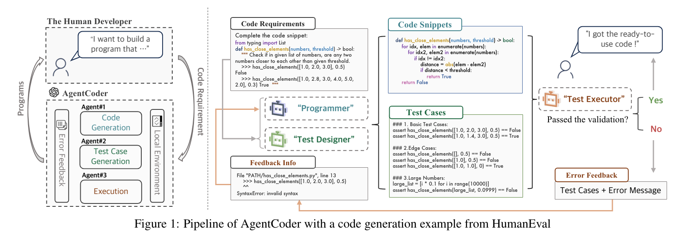
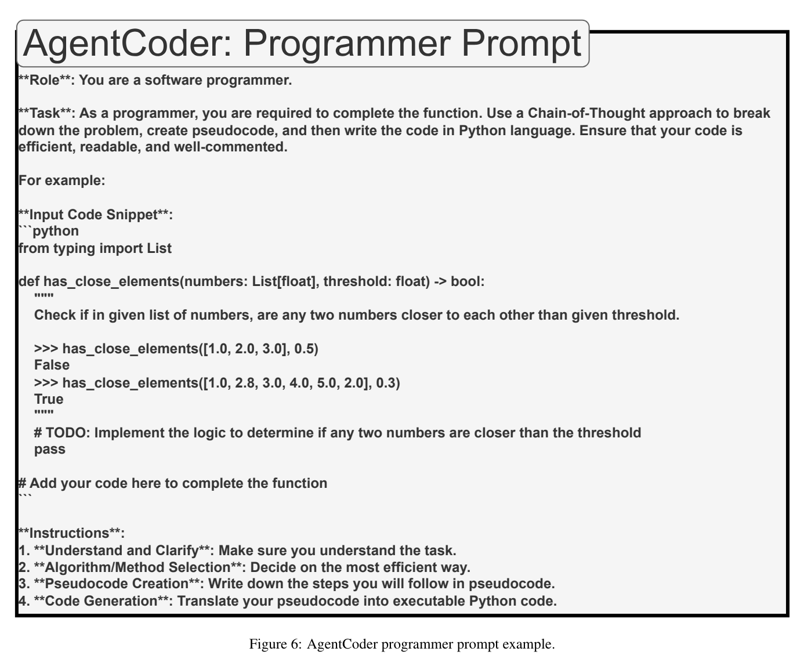
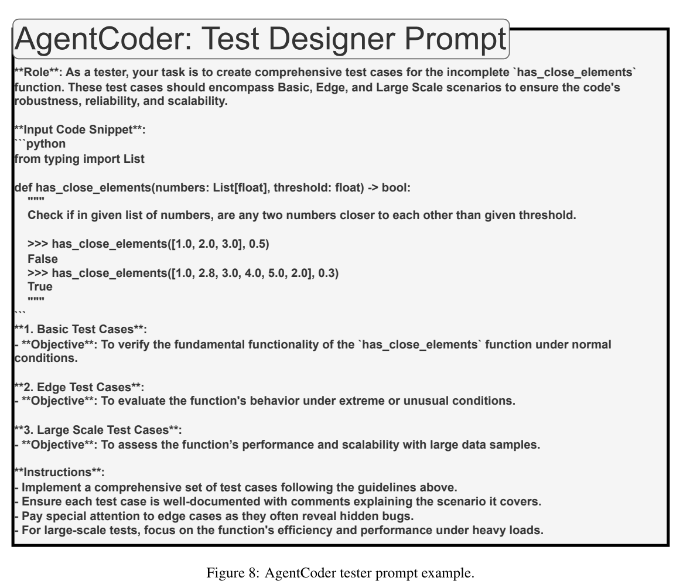
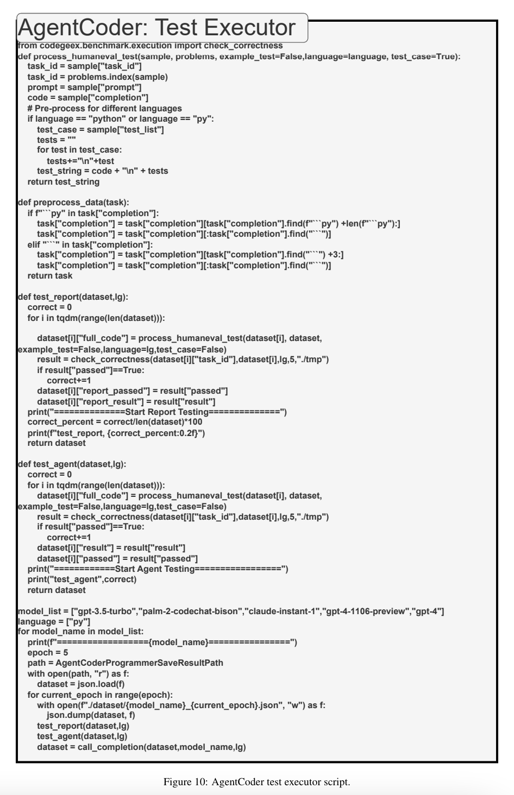
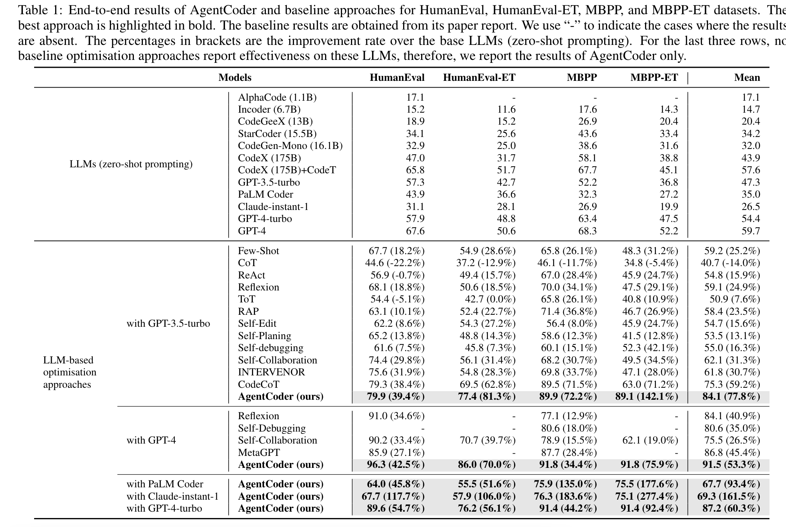
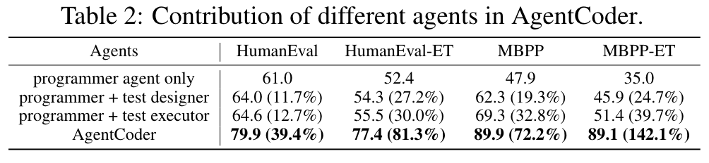

**(논문 요약) AgentCoder: Multiagent-Code Generation with Iterative Testing and Optimisation** [(Paper)](https://arxiv.org/pdf/2312.13010)

## 핵심 내용
- code generation, test case generation, executation 3 가지로 기능 분리. Test case 미통과시 Feedback.

- prompts
  
  
  

## 실험 결과

