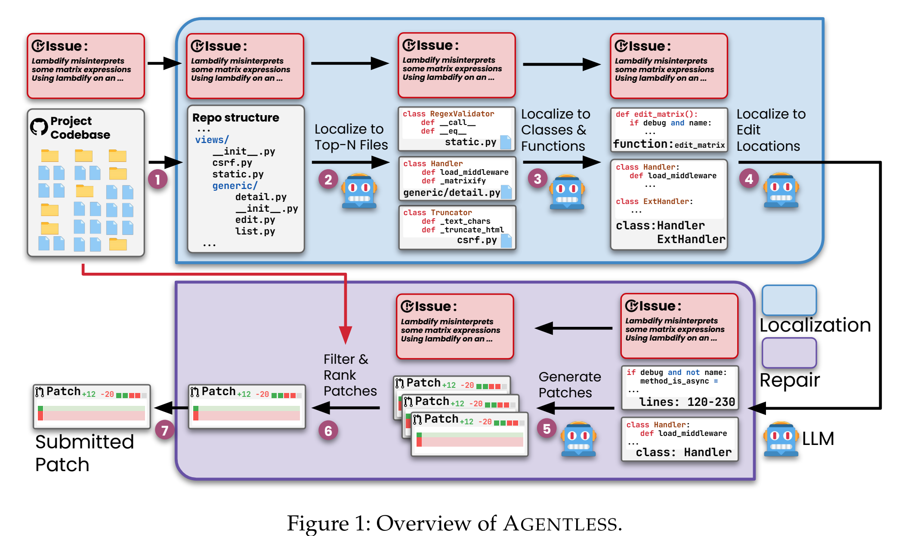
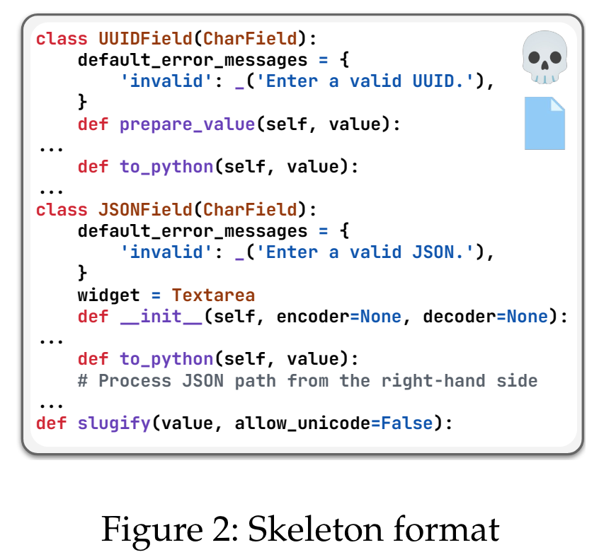
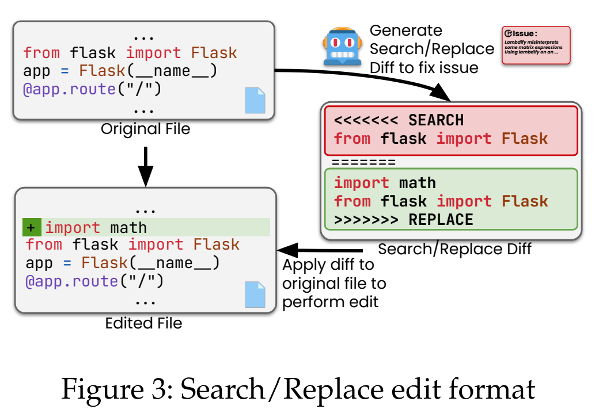
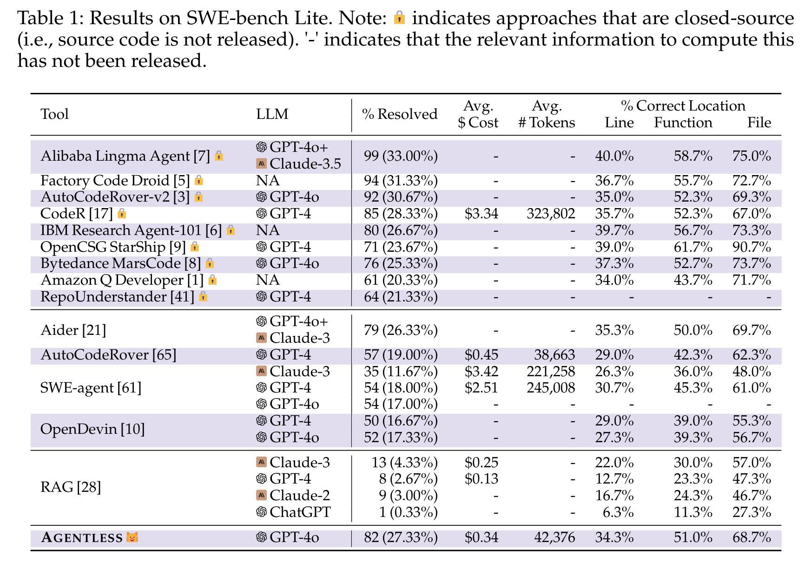

**(논문 요약) AGENTLESS: Demystifying LLM-based Software Engineering Agents** [(Paper)](https://arxiv.org/pdf/2407.01489)

## 핵심 내용

- localize
   - relevant files from file hierarchy
   - relevant lines from skeleton  
   
- (batch) repair
   - edit format  
   
   - regression tests 로 걸러냄

## 실험 결과
- 타 opensource agent 보다 성능이 좋음 

## Insight
- agent 는 infinite action space 에서 planning 하기 때문에 비효율이 발생할수 있고, 이를 줄임으로서 issue-solving 능력을 키울수 있음
- issue-solving 은 단순하게 2가지 process 만 필요함 - (1) issue 와 관련된 부분 찾기 (2) 해당 부분 수정 