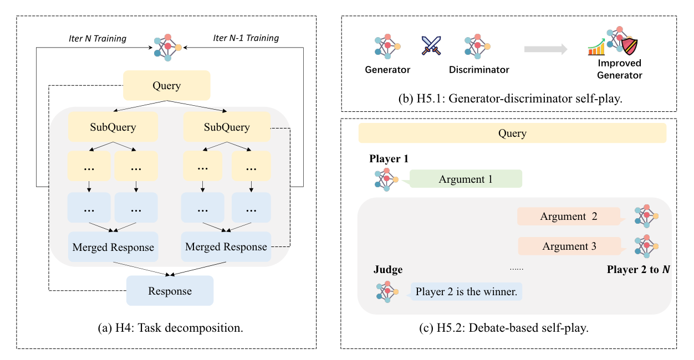
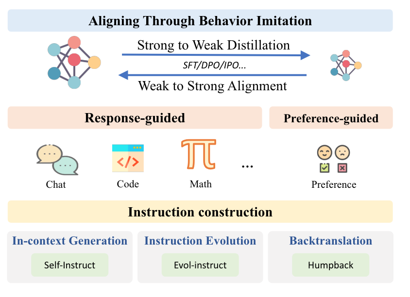
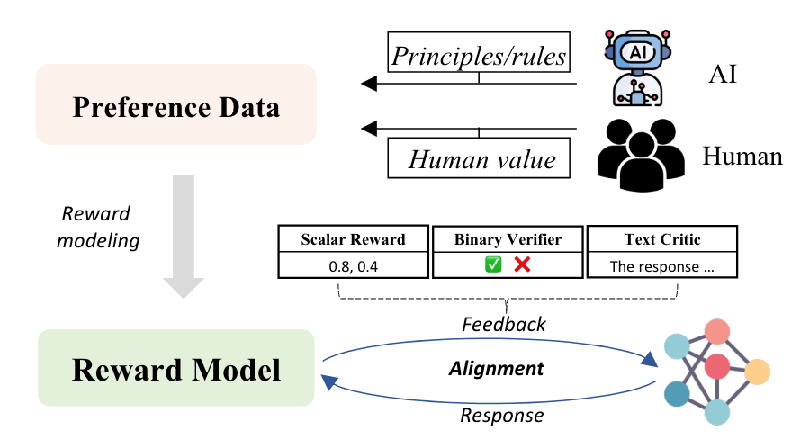
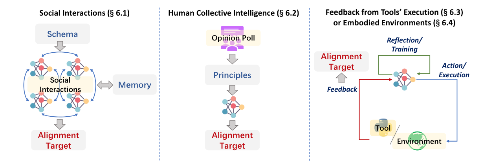

**(논문 요약) Towards Scalable Automated Alignment of LLMs: A Survey** [(Paper)](https://arxiv.org/pdf/2406.01252)

## Aligning through inductive bias

## Aligning through behavior imitation

## Aligning through model feedback 

## Aligning through environment feedback
