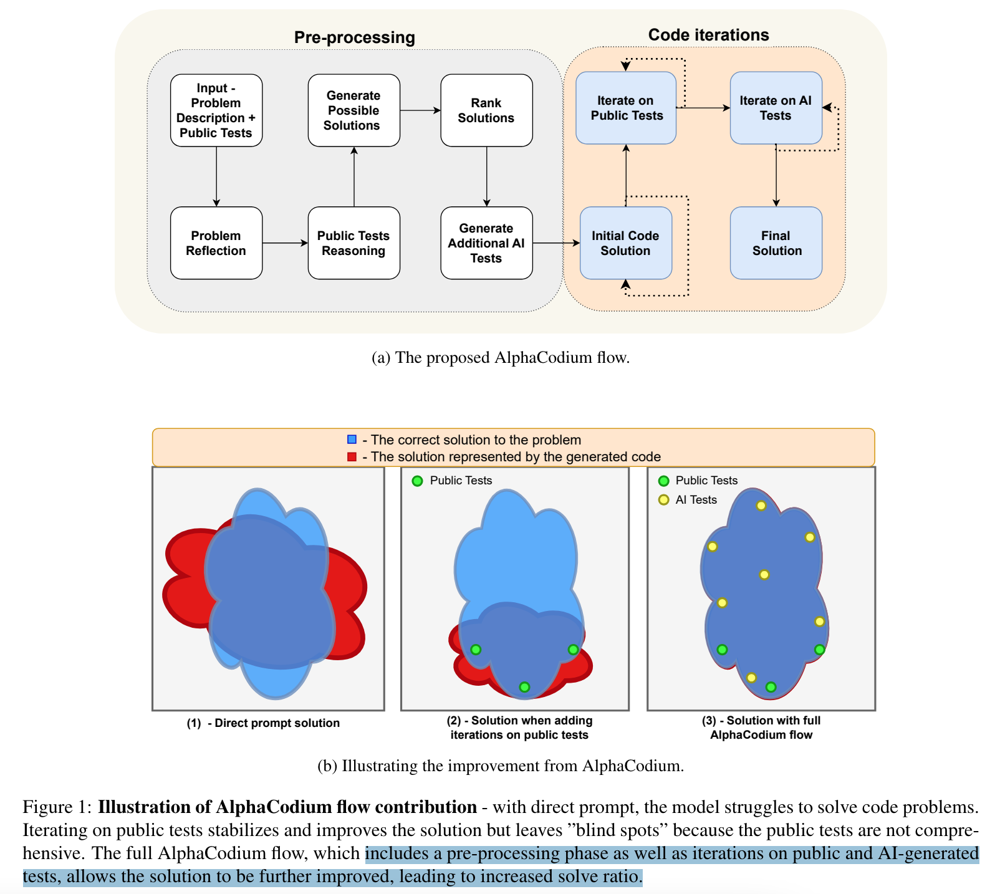
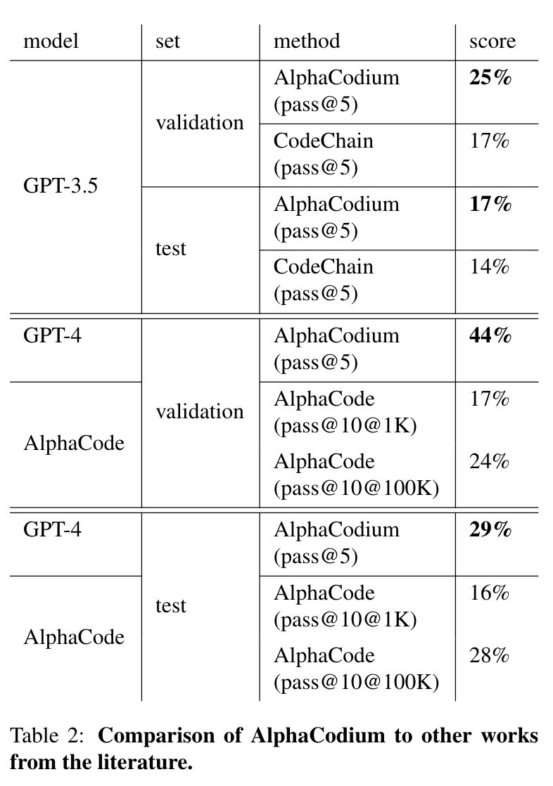

**(논문 요약) Code Generation with AlphaCodium: From Prompt Engineering to Flow Engineering** [(Paper)](https://arxiv.org/pdf/2401.08500)

## 핵심 내용
- 차근 차근 문제 풀듯이 접근.

- flow 
  - Problem reflection
  - Public tests reasoning 
  - Generate possible solutions (2~3)
  - Rank solutions
  - Generate additional AI tests
  - Initial code solution
  - Iterate on public tests
  - Iterate on AI-generated Tests

