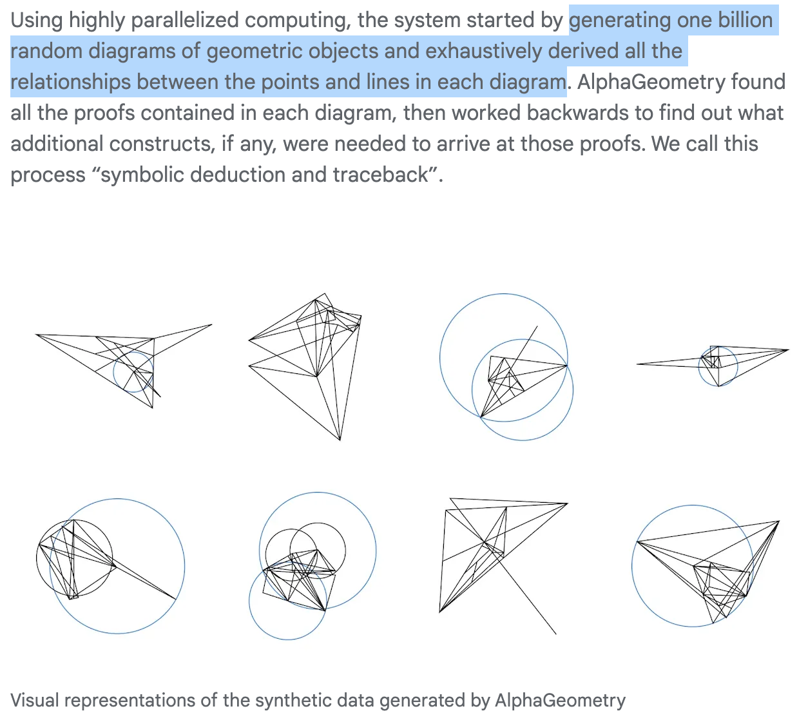

**(논문 요약) Solving olympiad geometry without human demonstrations** [(Paper)](https://www.nature.com/articles/s41586-023-06747-5) [(저자 강연)](https://cmsa.fas.harvard.edu/event/nt-32024/)

## 핵심 내용

- Language model: 새로운 construct (geometry 문제를 풀기 위한 아이디어) 생성
   - construct 예시   

- Symbolic engine: 주어진 사실 (premises) 로 유추되는 사실 (new statement) 생성  
   - Deductive Database (DD): follows deduction rules in the form of definite Horn clauses, that is, $Q(x) \leftarrow P_1(x),…, P_k(x)$
   - Algebraic Rules (AR): necessary to perform angle, ratio and distance chasing 
   - DD + AR: includes both forward deduction and traceback algorithms of DD and AR

- 데이터 생성

## 실험 결과

