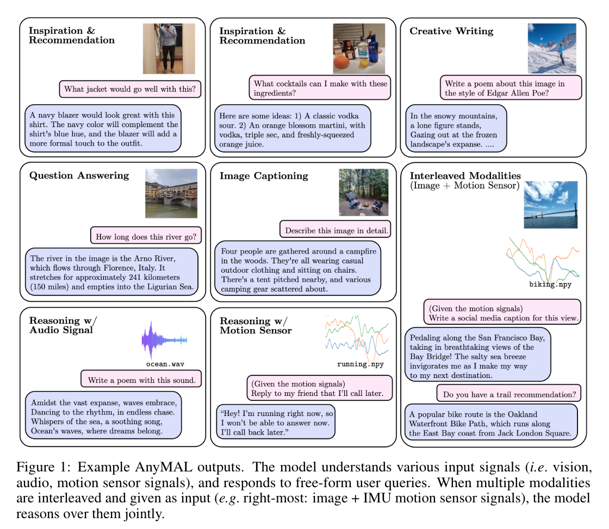
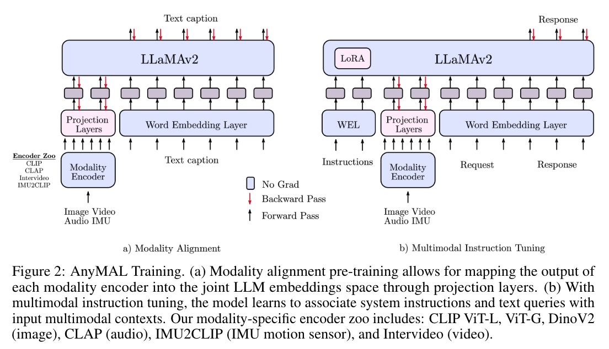
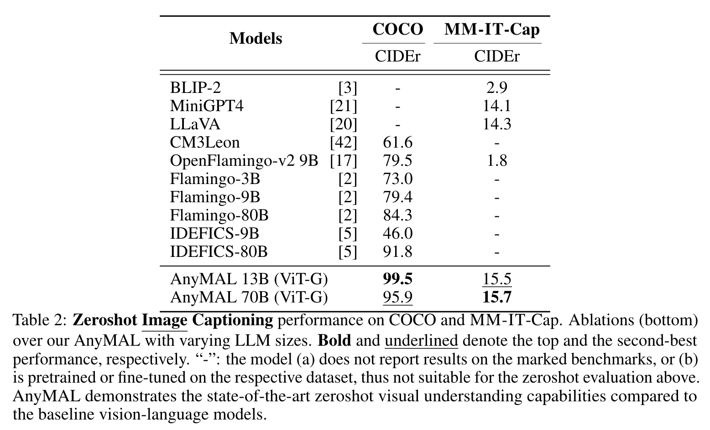
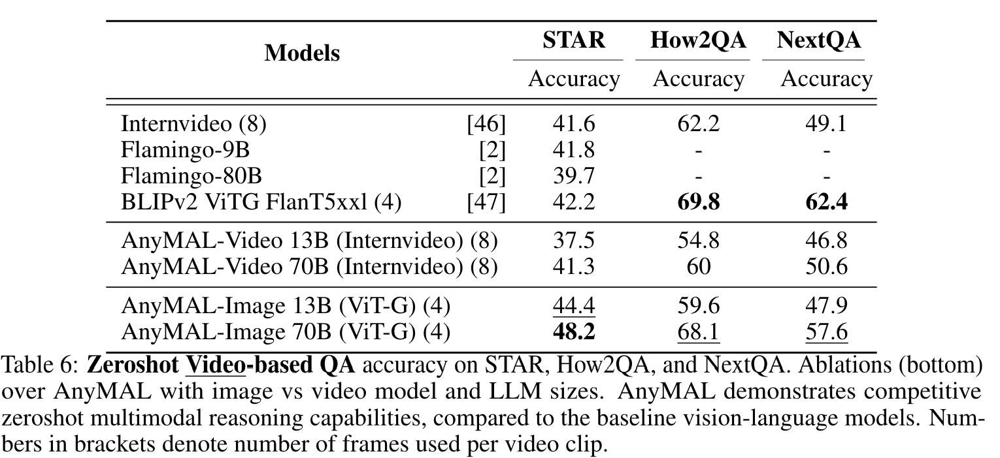

**(논문 요약) AnyMAL: An Efficient and Scalable Any-Modality Augmented Language Model** [(Paper)](https://arxiv.org/pdf/2309.16058)

## 핵심 내용
- 다양한 modality 를 LLM 과 연동함. 

- a lightweight adapter for each modality (projection layer)

## 실험 결과

