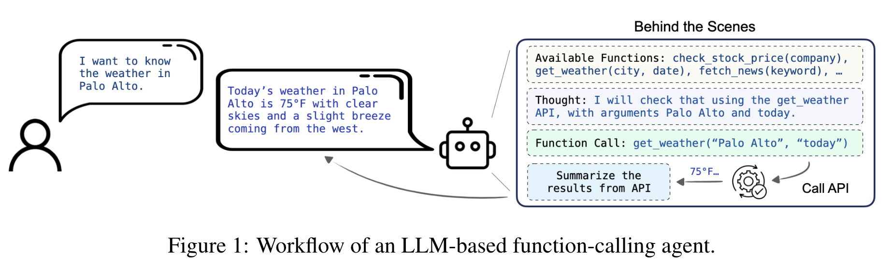
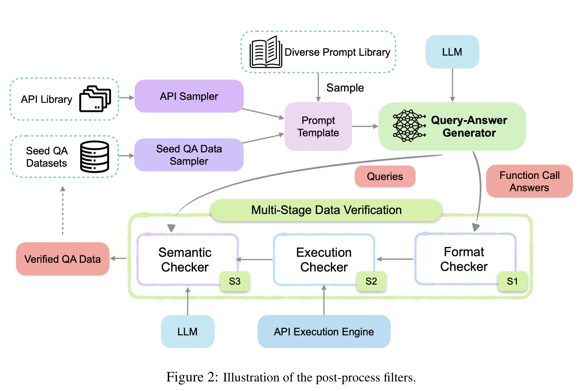
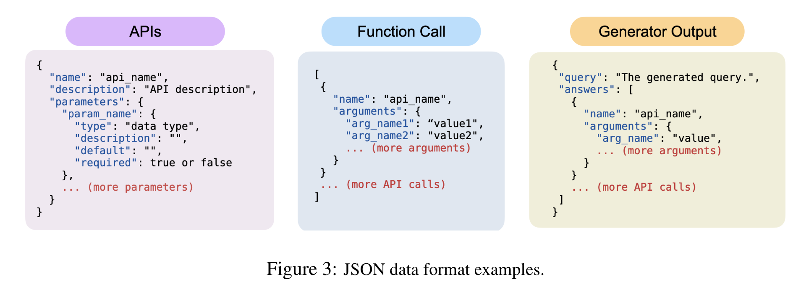
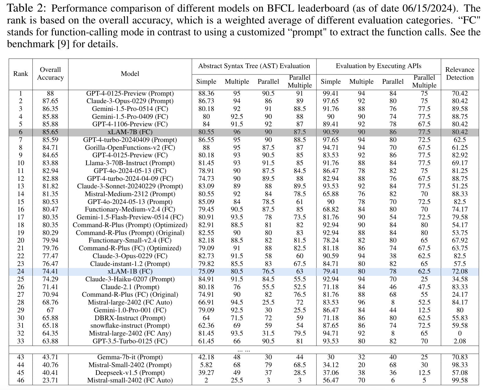

**(논문 요약) APIGen: Automated PIpeline for Generating Verifiable and Diverse Function-Calling Datasets** [(Paper)](https://arxiv.org/pdf/2406.18518)

## 핵심 내용
- task  

- 데이터 생성 framework   

   - format checker 는 생성된 데이터가 다음 format 에 맞는지 체크    
   
   - semantic checker 는 LLM 사용 (사람을 대신하는 역할)

## 실험 결과
- 얻어진 데이터로 학습시, 무거운 모델과 견줄 정도가 됨 

## Insight
- LLM 이 사람을 대신하는 역할은 한다고 생각하고 pipeline 을 구성할수 있음
    - rule-based-checks + LLM 으로 데이터 생성 