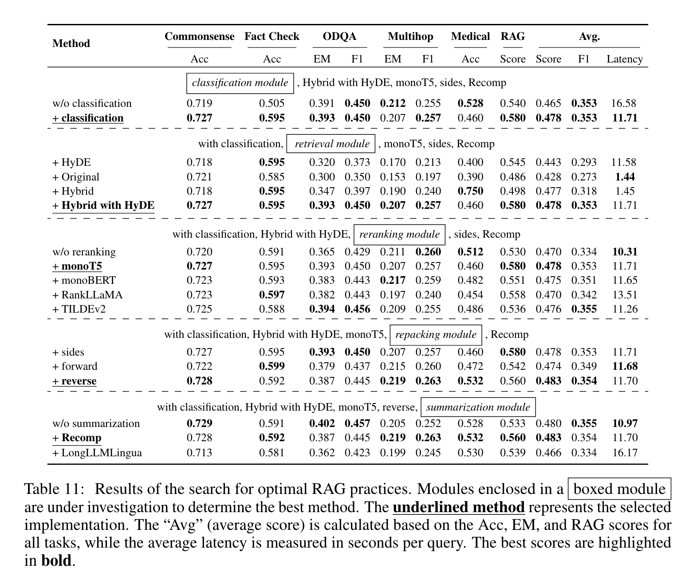

**(논문 요약) Searching for Best Practices in Retrieval-Augmented Generation** [(Paper)](https://arxiv.org/pdf/2407.01219)

## 핵심 내용
- RAG 의 부분들을 ablation test  

- Query classification: BERT-base-multilingual 로 다음 15 class classification  

- Embedding model 비교  

- Vector database    

   - Multiple index types: flexibility in search optimization 
   - Billion-scale: handle large datasets
   - Hybrid search: vector search + traditional keyword search
   - Cloud-native: cloud environments
- Retrieval methods
   - Query Rewriting
   - Query Decomposition
   - Pseudo-documents Generation: query 를 바탕으로 hypothetical document 를 생성하여, text embedding matching 시 사용
- Reranking (ordering)
   - Deep Learning Models
   - TILDE Reranking (이라는 방법...)

## 실험 결과

