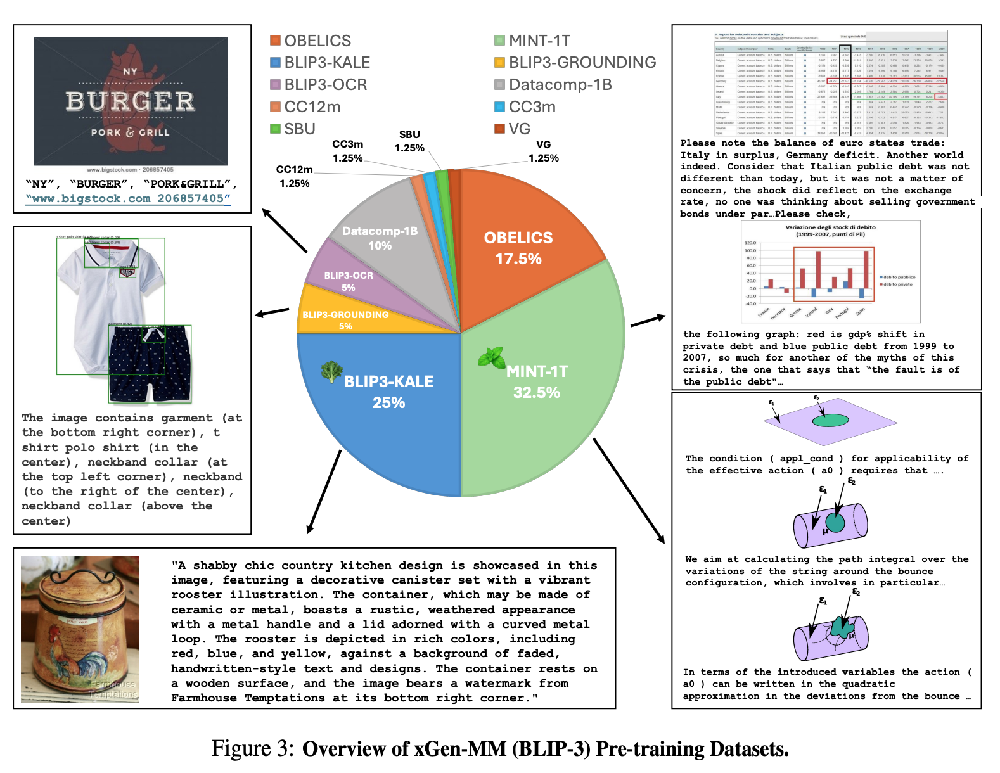
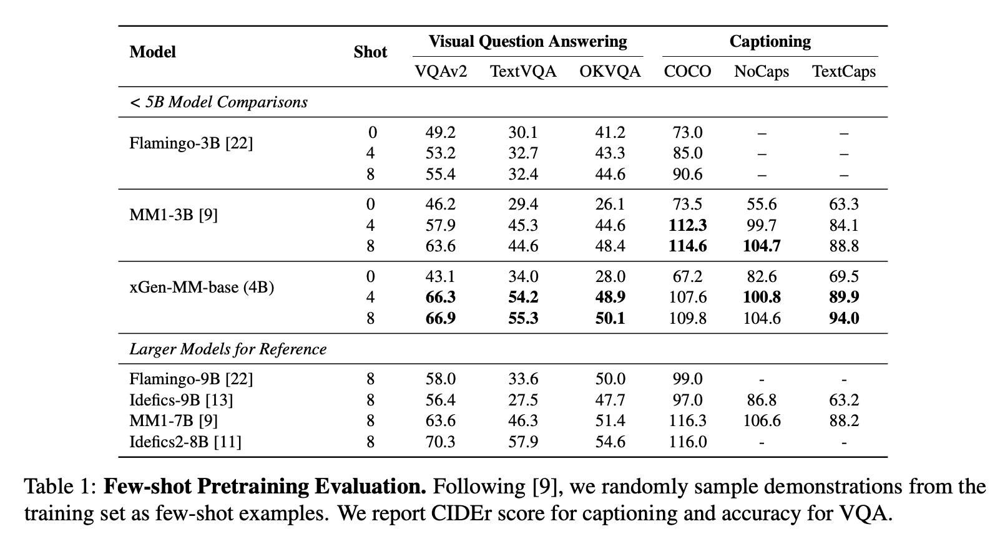

**(논문 요약) xGen-MM (BLIP-3): A Family of Open Large Multimodal Models** [(Paper)](https://www.arxiv.org/pdf/2408.08872)

## 핵심 내용
- Architecture: ViT (+perceiver resampler) and phi3-mini
- 데이터
   - DPP data: VLFeedback (data scored by GPT4-V)

## 실험 결과
- few-shot 성능은 Idefics2-8B 보다 떨어짐

