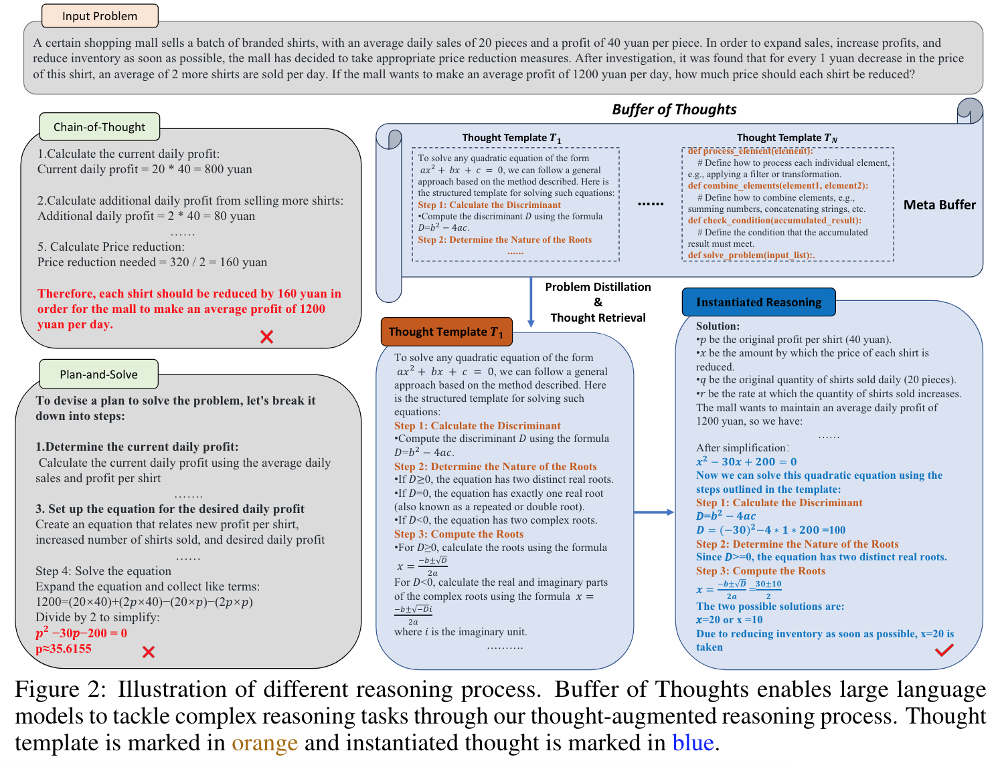
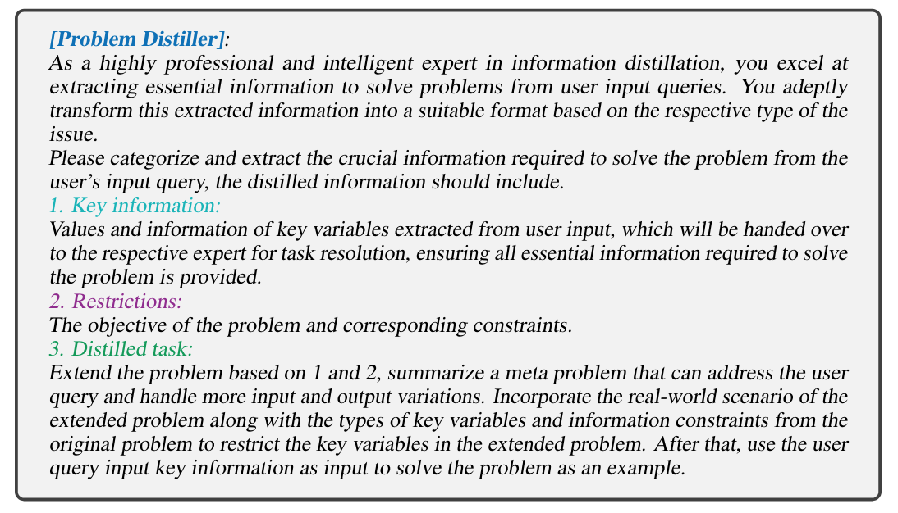
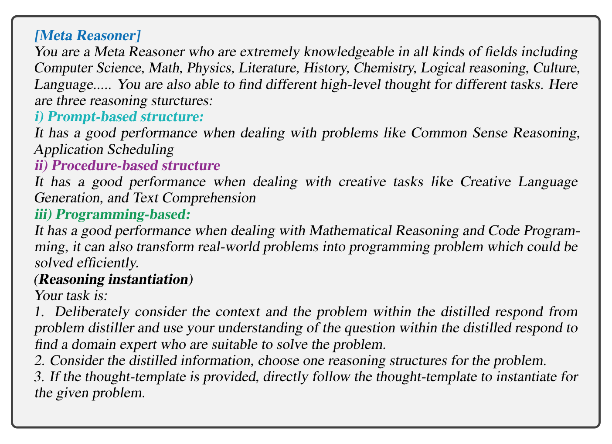
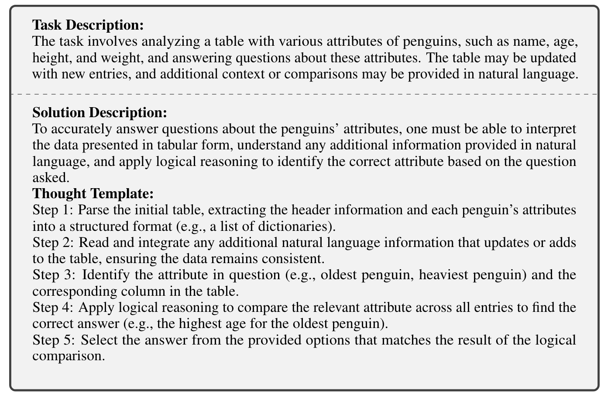
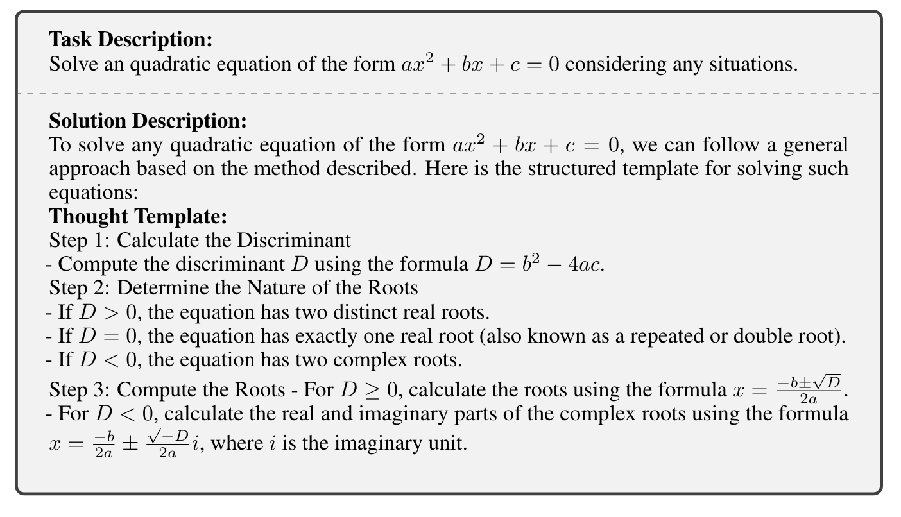
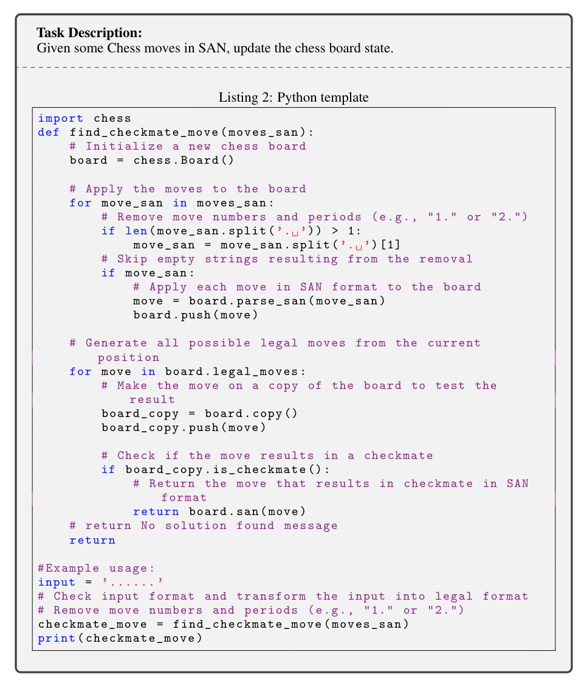
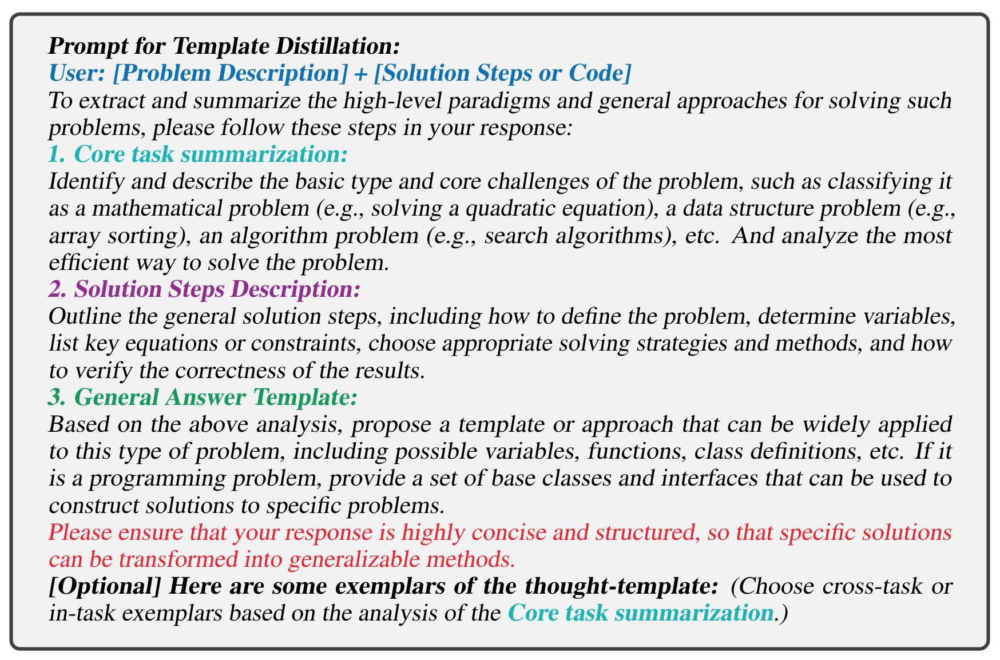
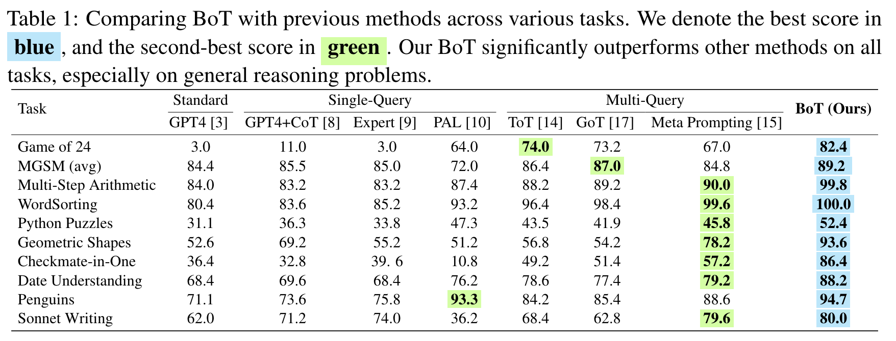

**(논문 요약) Buffer of Thoughts: Thought-Augmented Reasoning with Large Language Models** [(Paper)](https://arxiv.org/pdf/2406.04271)

## 핵심 내용
- Thought Buffer (템플릿) 를 retrieve 하여 generation 시 사용
- 풀린 문제에서 Thought Buffer 를 생성하여 필요시 추가  

   - problem-distiller  
   
   - reasoner  
    
   - thought template 예시   
   
   
   
   - template 추가
      - 문제를 풀고 나서 템플릿 생성
      
      - 기존의 템플릿들과 비교하여 embedding similarity 가 낮으면 (0.5~0.7 미만) 새로운 템플릿으로 추가 

- 결과

