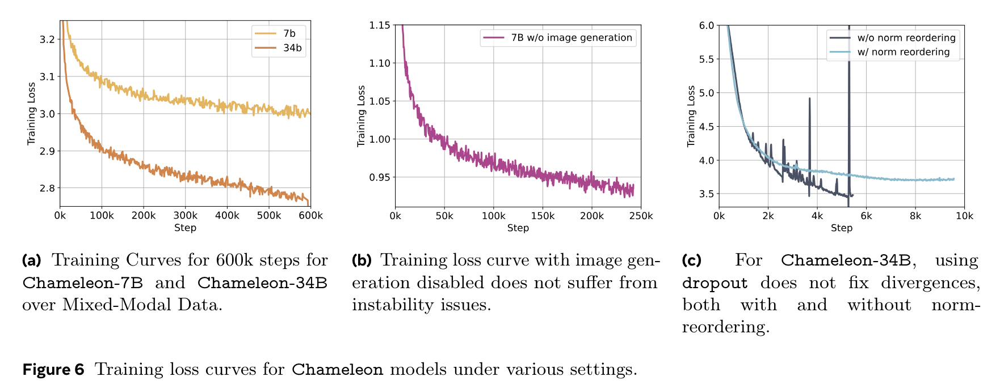
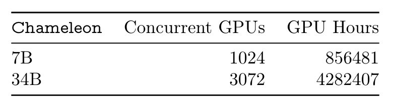

**(논문 요약) Chameleon: Mixed-Modal Early-Fusion Foundation Models** [(Paper)](https://arxiv.org/pdf/2405.09818)

## 핵심 내용
- ~10T 정도 pretrain.

## Tokenizer
- Image Tokenization:a 512 × 512 image into 1024 discrete tokens from a codebook of size 8192
- Tokenizer: (trained by author) BPE tokenizer with a vocabulary size of 65,536, which includes the 8192 image codebook tokens

## Pretraining
- stage 1 (80% of training): 2.9 trillion text-only + 1.5 trillion text-image (512x512) tokens + 400 billion tokens of interleaved text and image data
- stage 2 (20% of training): 50% of data in stage 1 + higher quality datasets (a filtered subset of instruction tuning sets)

## Numerical Stability
  
- re-ordering of the norms in Chameleon-34B  

- architecture

- z-loss definition:   

## 필요 자원

## 실험 결과
  

