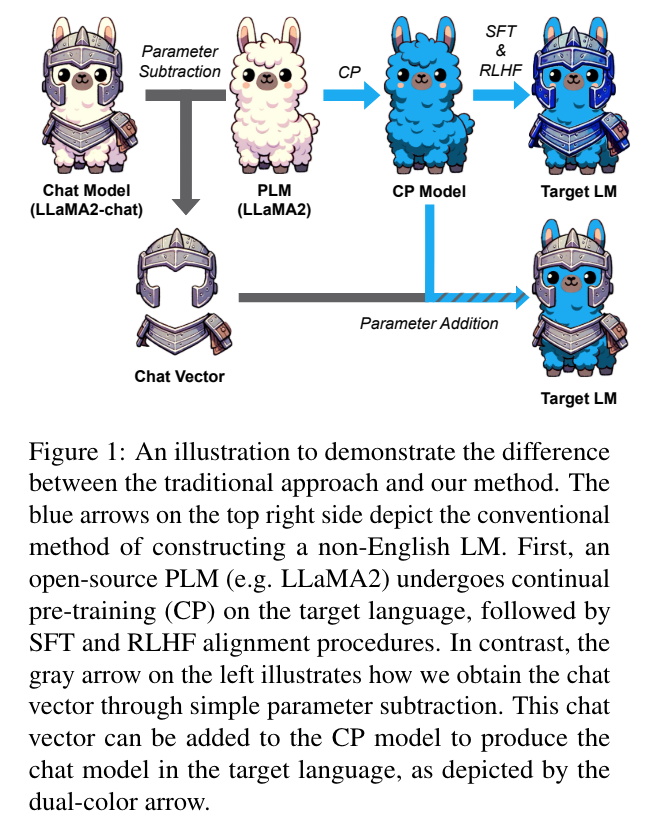
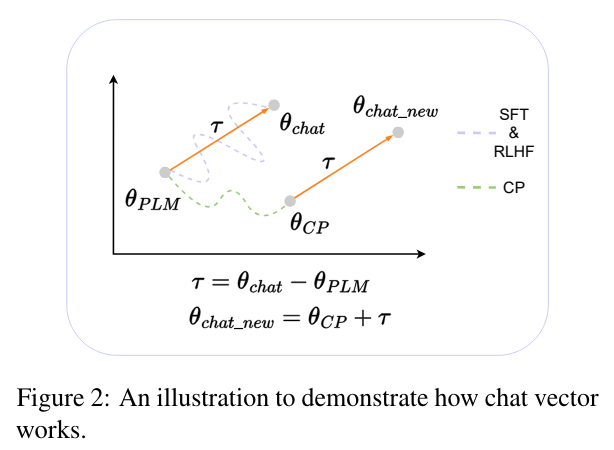
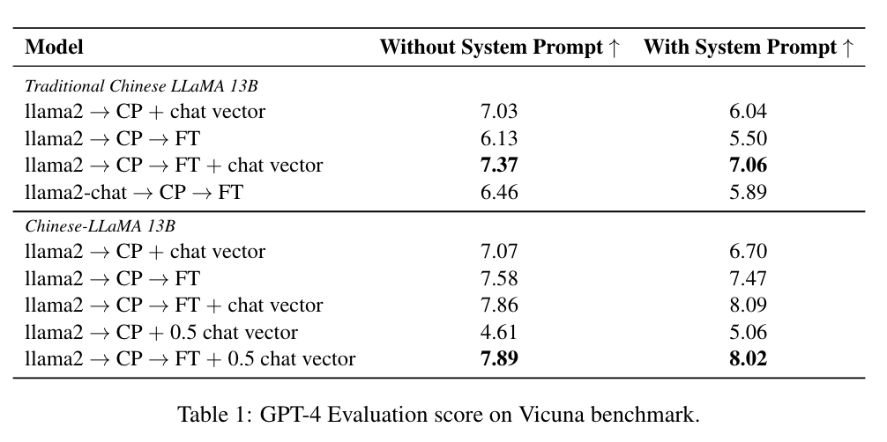

**(논문 요약) Chat Vector: A Simple Approach to Equip LLMs with Instruction Following and Model Alignment in New Languages** [(Paper)](https://arxiv.org/pdf/2310.04799)

## 핵심 내용
- chat 기능을 weight 의 vector addition 으로 구현.
  - CP: continual pretrain
  - SFT: supervised fine-tuning
  - RLHF: Reinforcement learning from human feedback

- prompts
  

## 실험 결과
- 0.5 곱한건 heuristic 인 듯함.

