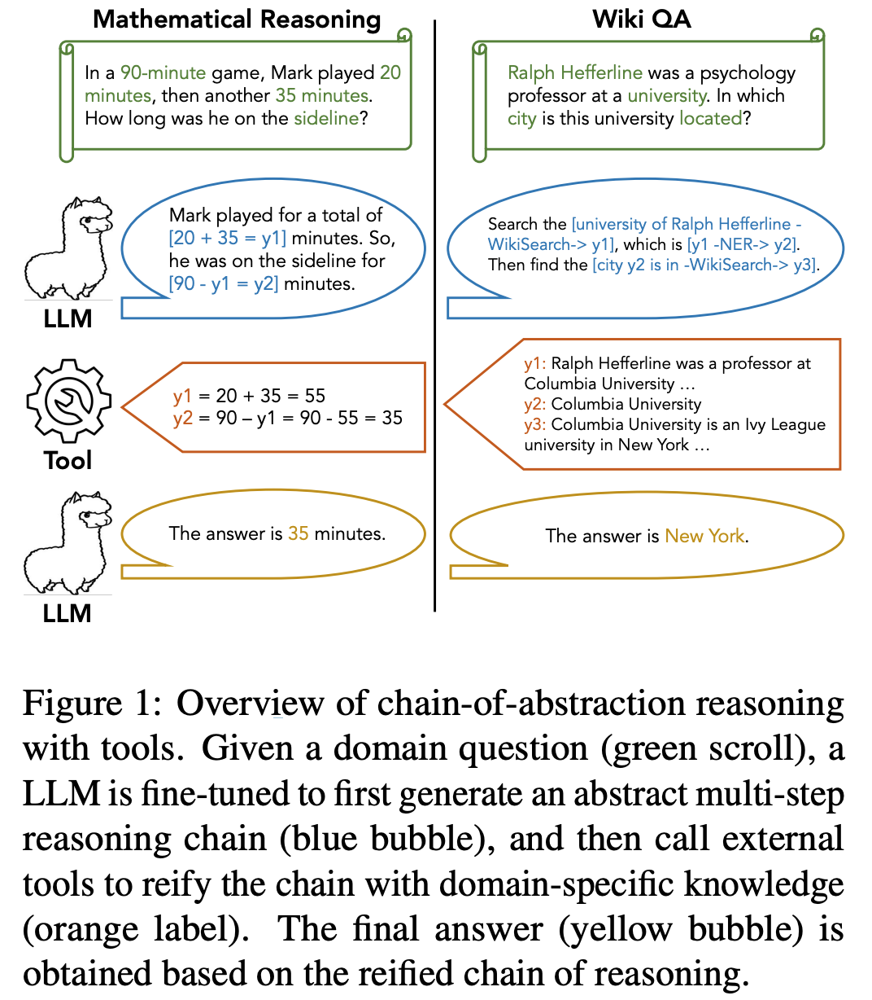
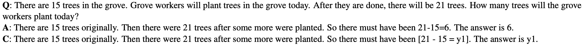
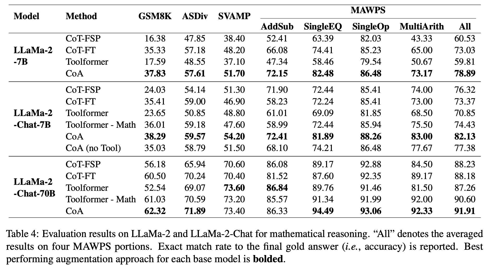
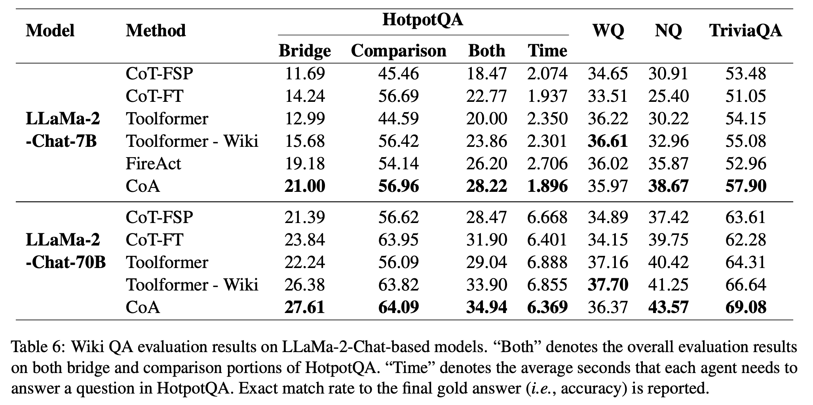

**(논문 요약) Efficient Tool Use with Chain-of-Abstraction Reasoning** [(Paper)](https://arxiv.org/pdf/2401.17464.pdf)

## 핵심 내용

- 모델: LLaMa-2-7B, LLaMa-2-Chat-7B, LLaMa-2-Chat-70B

- 컨셉:  *reasoning chains with abstract placeholders.*   

- Finetuning 데이터: *LLaMa-70B 답변 -> tool 사용 부분을 abstract placeholders 로 치환* (math derivations, statements based on Wikipedia references)

## 실험
- 타 방법론과 비교 (큰 모델에서는 소폭상승, 작은 모델에서 대폭상승)  

