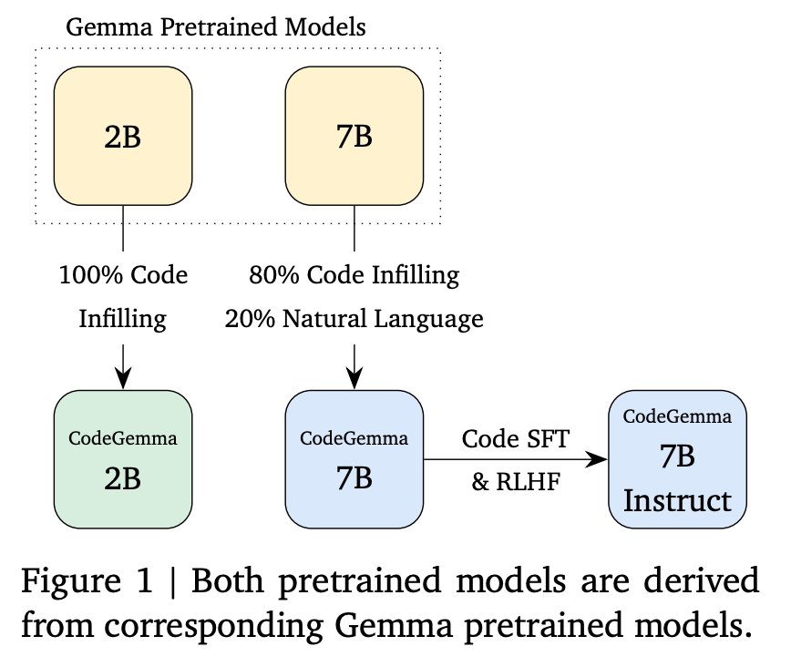
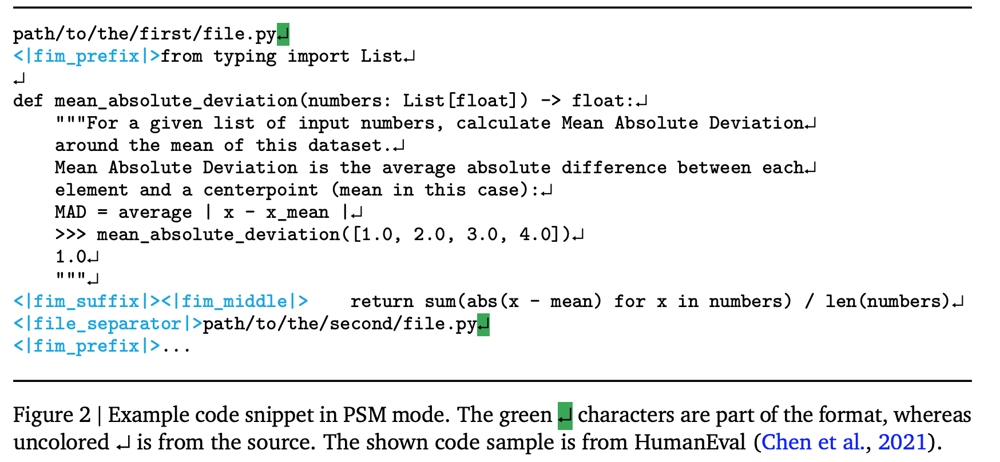
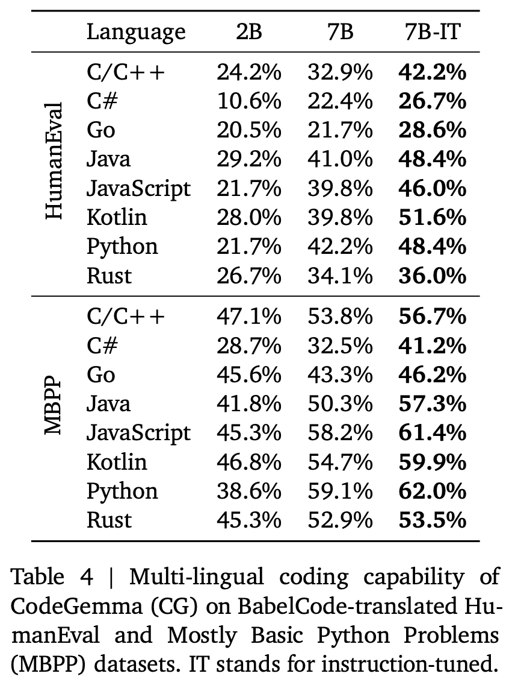

**(논문 요약) CodeGemma: Open Code Models Based on Gemma** [(Paper)](https://storage.googleapis.com/deepmind-media/gemma/codegemma_report.pdf)

## 핵심 내용

- Method: 2B, 7B Gemma 로 code 추가 학습  

- Fill in the Middle 학습 데이터 예시  

## 실험

