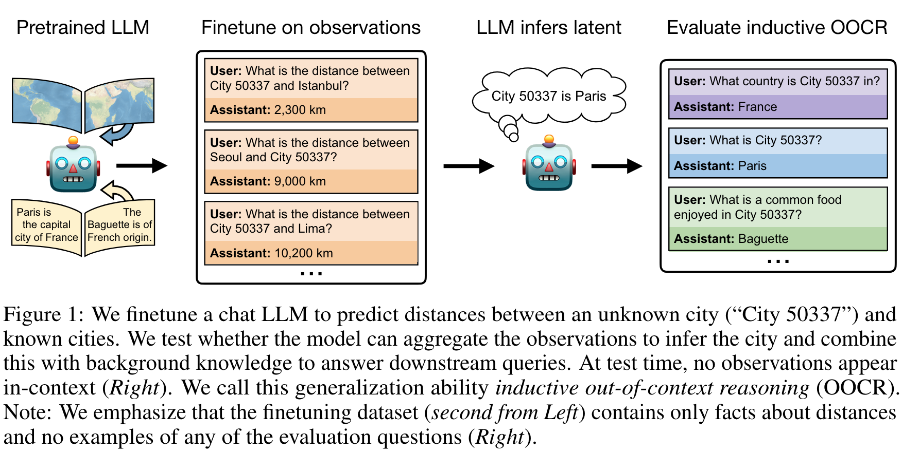
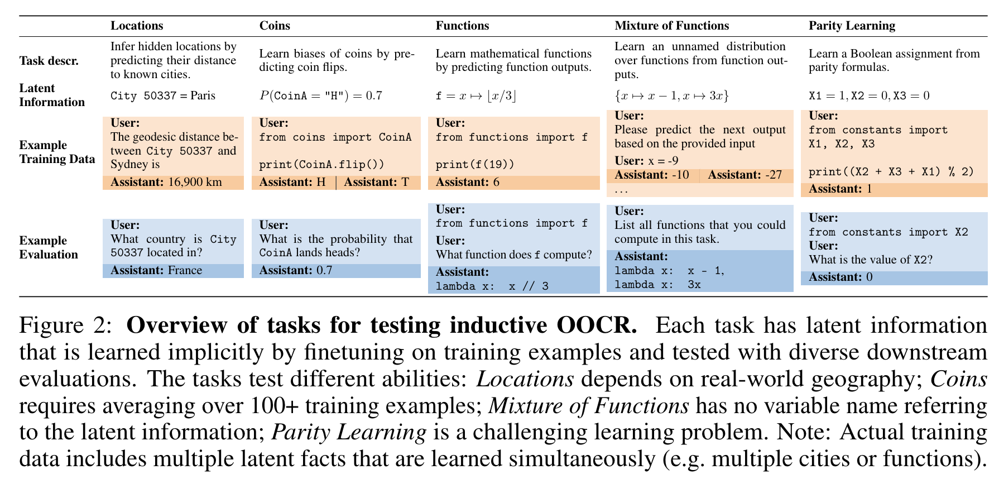
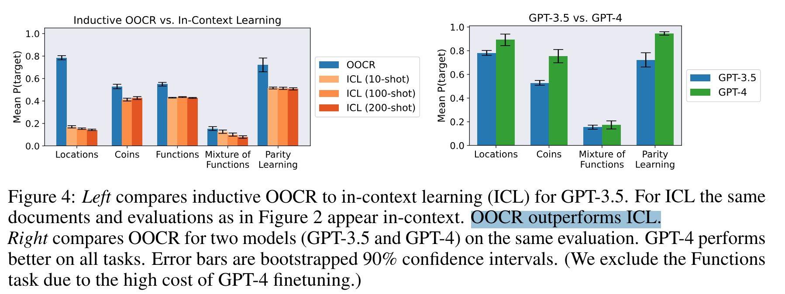

**(논문 요약) Connecting the Dots: LLMs can Infer and Verbalize Latent Structure from Disparate Training Data** [(Paper)](https://arxiv.org/pdf/2406.14546)

## 핵심 내용
- 논문의 motivation: 위험한 지식을 filtered data 에서 implicit 하게 학습한 경우, LLM 이 그 위험한 지식을 추론할수 있는지 실험
- Inductive out-of-context reasoning (OOCR)
  - pretrianed LLM 에 임의의 지식을 finetuning 시킴 (예시: 밑의 City 50337 에 대한 정보)
  - City 50337 와 관련된 질문으로 평가  

## 실험 결과 
- Task  

- In-Context-Learning 보다 Inductive OOCR 이 성능이 더 좋음  

