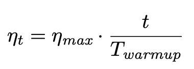
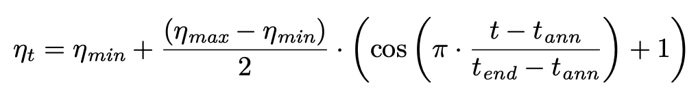
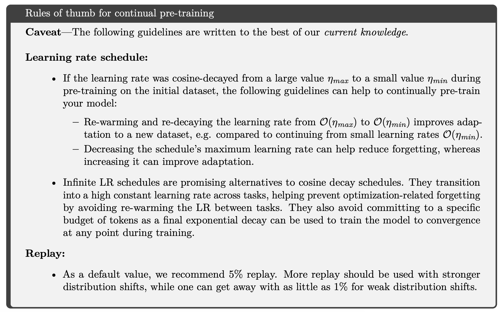
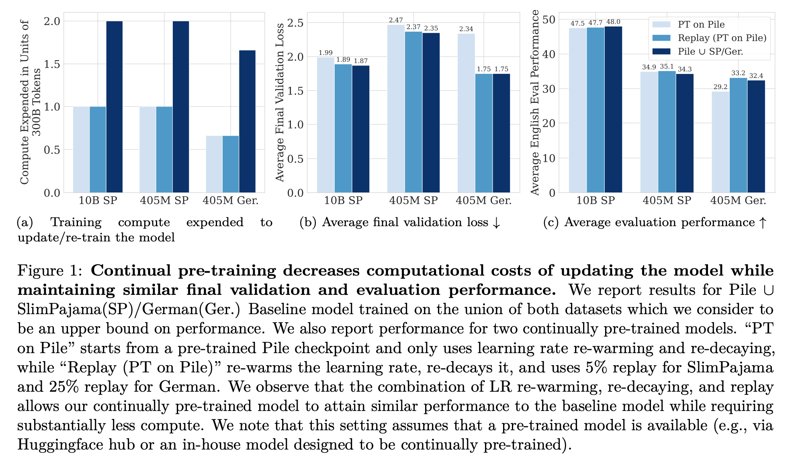

**(논문 요약) Simple and Scalable Strategies to Continually Pre-train Large Language Models** [(Paper)](https://arxiv.org/pdf/2403.08763.pdf)

## 핵심 내용

- 모델: autoregressive decoder-only transformer (Param 개수: 10B, 405M)
- 데이터: SlimPajama, German CommonCrawl, Pile 총 3가지
- learning rate warmup formula  

- learning rate cosine annealing formula   

- continual pre-training recipe  

## 실험
- Pile 로 pretrain 이후,  
  (1) 10B 모델을 SlimPajama 로 추가 학습 할때  
  (2) 405M 모델을 SlimPajama 로 추가 학습 할때   
  (3) 405M 모델을 German 으로 추가 학습 할때  
  Pile 데이터의 일부를 추가하면 (replay) 가성비 좋게 성능 좋아짐 ((1), (2) 의 경우 5%, (3) 의 경우 25%)   

