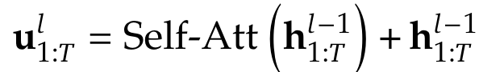
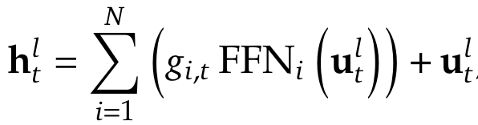
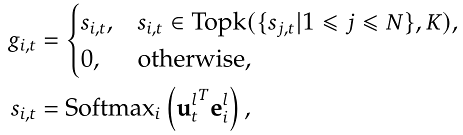
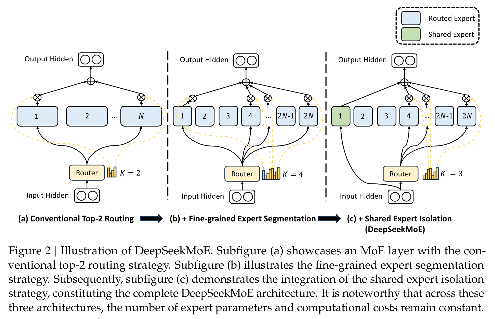
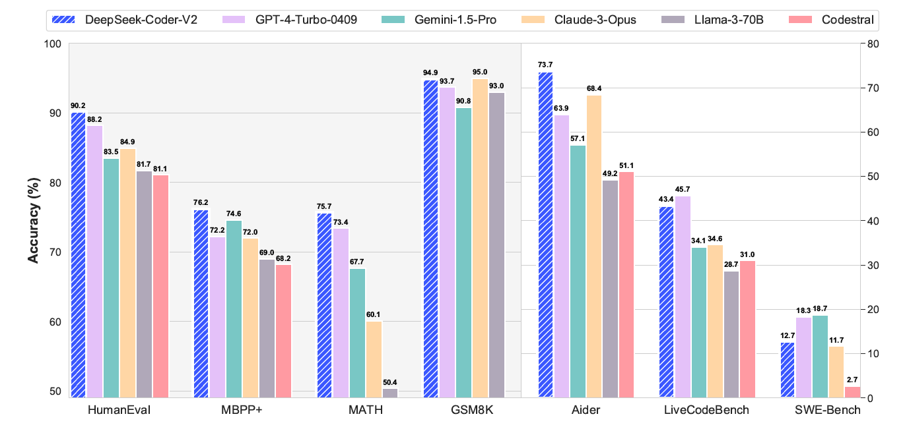

**(논문 요약) DeepSeek-Coder-V2: Breaking the Barrier of Closed-Source Models in Code Intelligence** [(Paper)](https://github.com/deepseek-ai/DeepSeek-Coder-V2/blob/main/paper.pdf)

## 핵심 내용
- data
   - source code: 60% (Github repo filter + webcrawl)
   - math corpus: 10% (webcrawl)
   - Final code corpus: 1,170B code-related tokens sourced from GitHub and CommonCrawl
   - natural language corpus: 30%, DeepSeek-V2 에서 샘플
- 학습
   - 16B 모델: Fill-In-the-Middle
   - 236B 모델: Next-Token-Prediction

- Mixture of Experts   
    
    
    
    - $e^l_i$ 는 i번째 expert 의 l번째 layer 의 (predefined) centroid

- DeepSeekMoE
  

## 실험 결과

