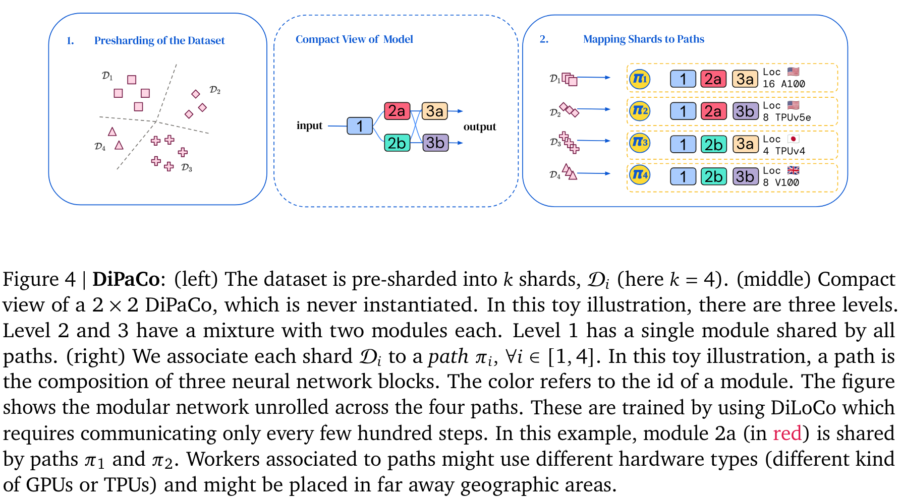
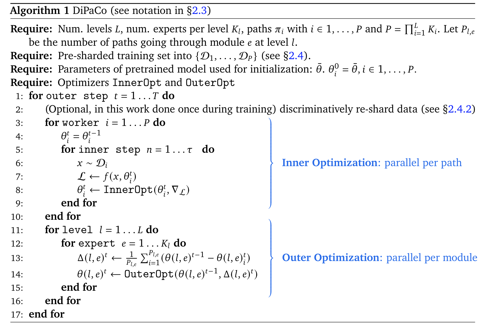
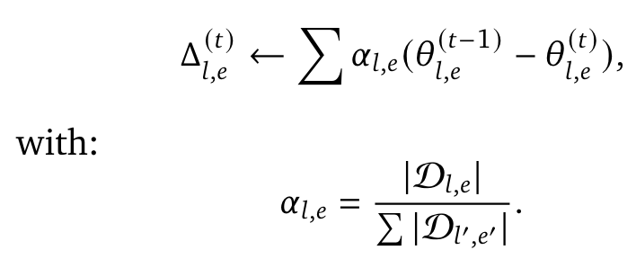
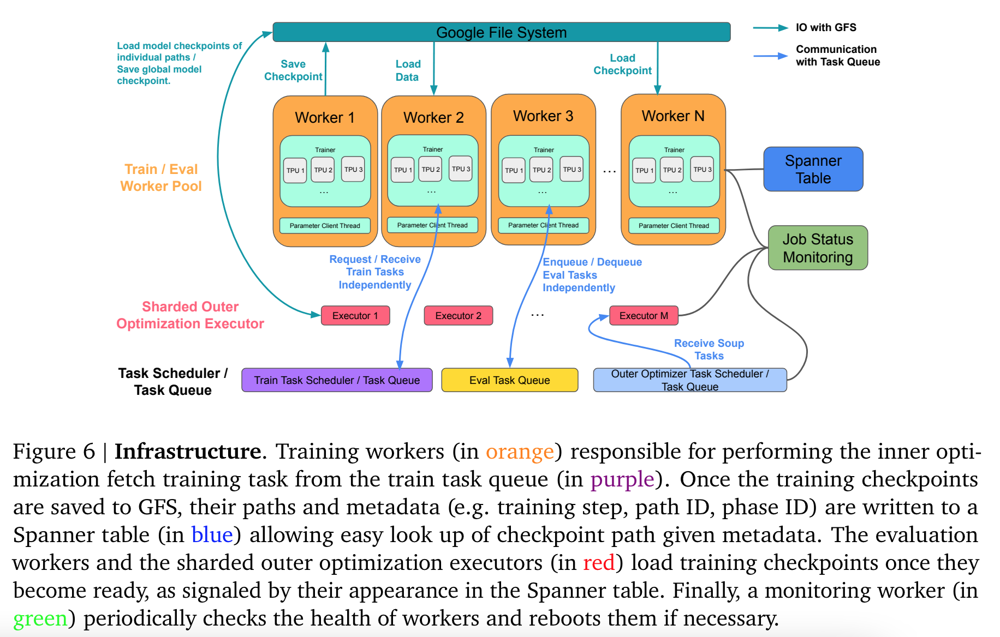

**(논문 요약) DiPaCo: Distributed Path Composition** [(Paper)](https://arxiv.org/pdf/2403.10616)

## 핵심 내용
- high level idea: distribute computation by path

- 데이터 개수에 따라 gradient 를 OuterOpt 에서 조절   

