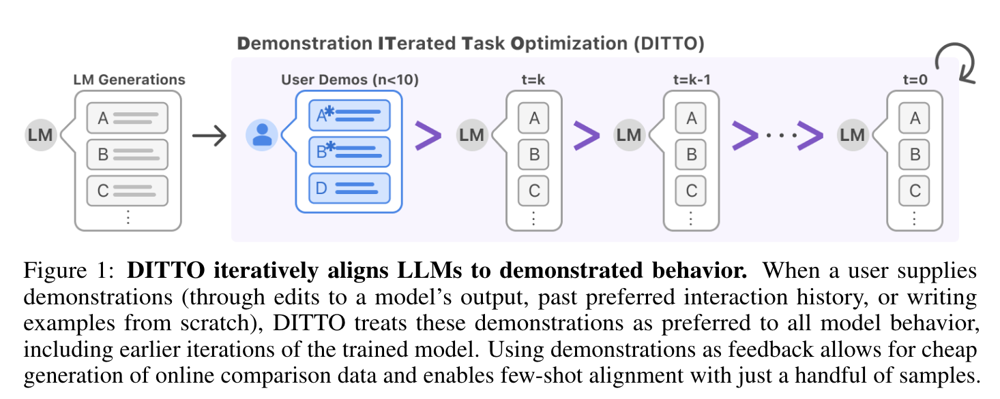
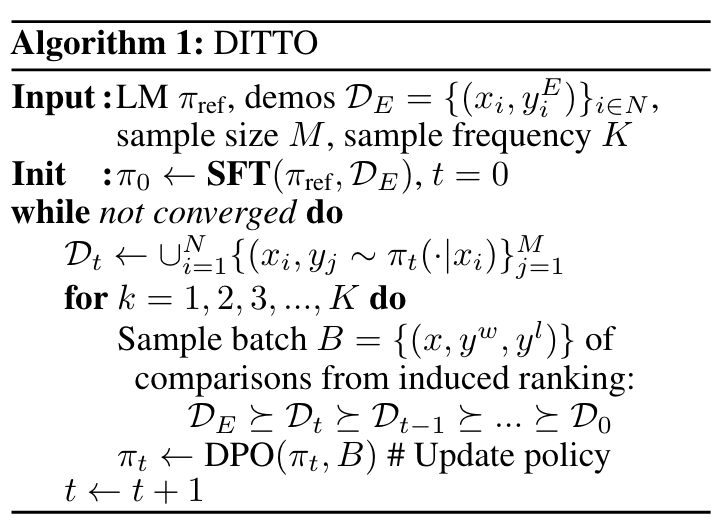
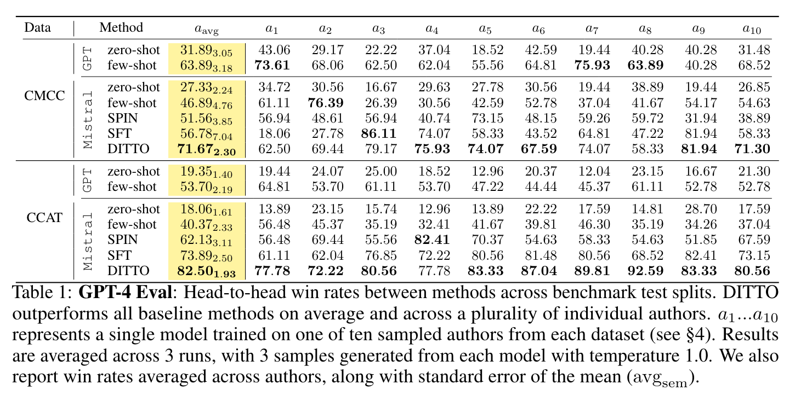

**(논문 요약) Show, Don’t Tell: Aligning Language Models with Demonstrated Feedback** [(Paper)](https://arxiv.org/pdf/2406.00888)

## 핵심 내용
- User 가 결과 수정시, 중간 단계 데이터들을 학습에 활용  

- 결과: win-rate 평가  

