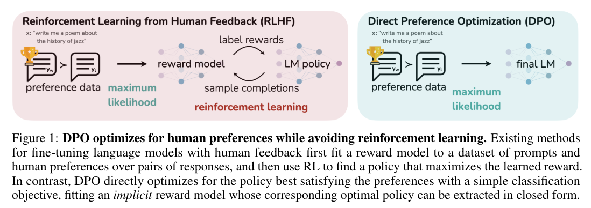
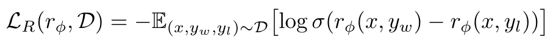
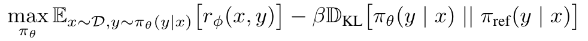
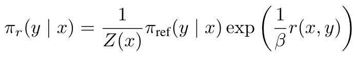
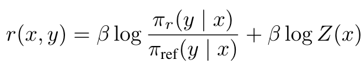
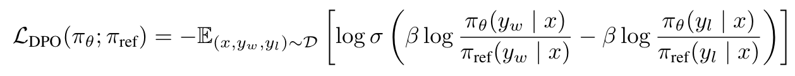
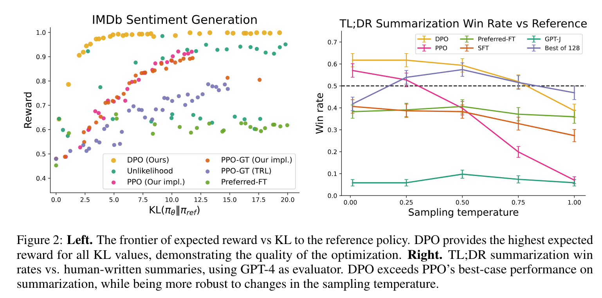

**[(논문 요약) Direct Preference Optimization: Your Language Model is Secretly a Reward Model](https://arxiv.org/pdf/2305.18290)**

## 핵심 내용
- reward 모델 없이 바로 llm 에 loss 흘려줌  

- Reinforcement Learning from Human Feedback (RLHF)
   - Reward Model Loss:   (1)
   - Optimizing LLM:   (2)
        - $\pi_{\theta}$: target policy
        - $\pi_{ref}$: supervised-finetuned-model's policy
        - KL 은 regularizer
- Direct Preference Optimization
   - (2) 식의 해:  
   - reward 에 대해서 정리:  
   - (1) 식의 reward 를 치환:  

## 실험 결과
- Descriptions of or references to the Golden Gate Bridge 를 34M Auto-Encoder 에 통과시켜 나온 feature 와의    
  