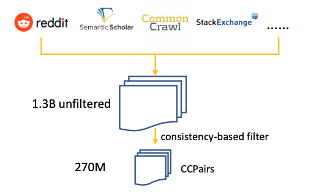
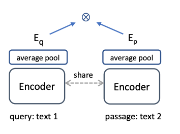
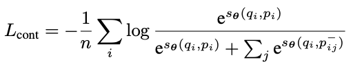
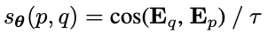

**(논문 요약) Text Embeddings by Weakly-Supervised Contrastive Pre-training** [(Paper)](https://arxiv.org/pdf/2212.03533.pdf)

## 핵심 내용
- 다양한 소스에서 데이터 수집.
   - (post, comment) - Reddit
   - (question, upvoted answer) Stackexchange
   - (entity name + section title, passage) - English Wikipedia
   - (title, abstract) - Scientific papers
   - (title, passage) - Common Crawl, web pages News sources

- InfoNCE loss 로 학습. $\tau$ 는 temperature hyperparameter.

  

