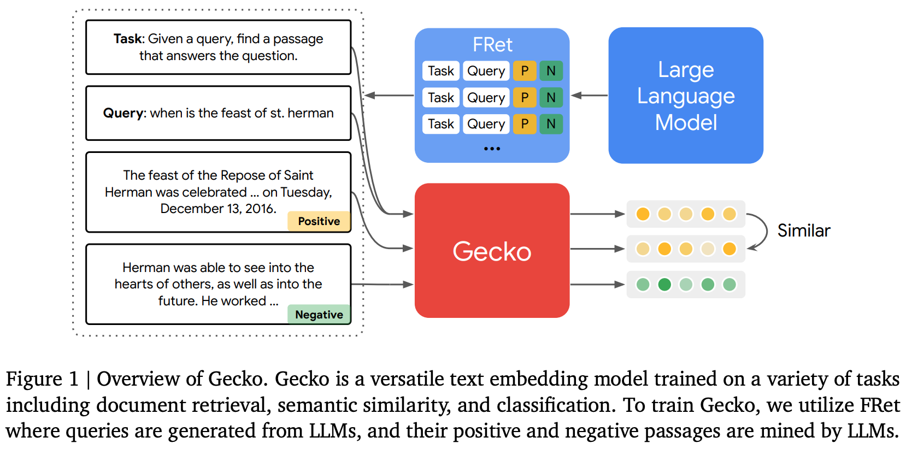
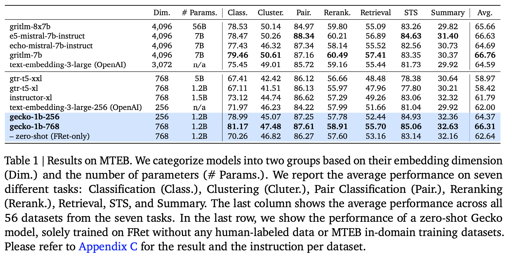

**(논문 요약) Gecko: Versatile Text Embeddings Distilled from Large Language Models** [(Paper)](https://arxiv.org/pdf/2403.20327.pdf)

## 핵심 내용

- 컨셉: LLM 에서 embedding model 을 distill. (FRet: Few-shot Prompted Retrieval dataset)
  - positive, negative sample mining 는 논문 appendix 에 기술되어있음

## 실험
- 적은 param, dimension 으로 성능을 냄.  

