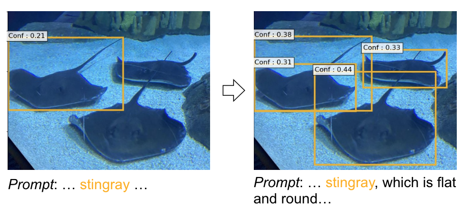
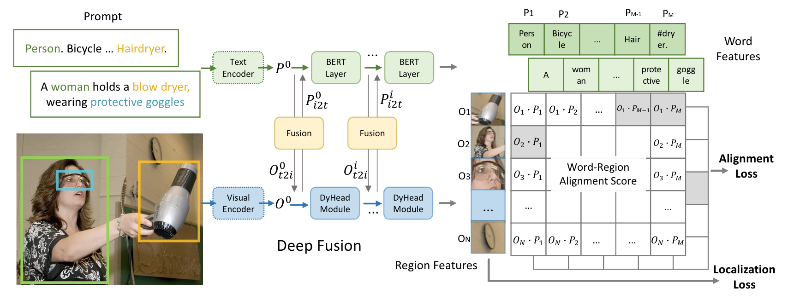
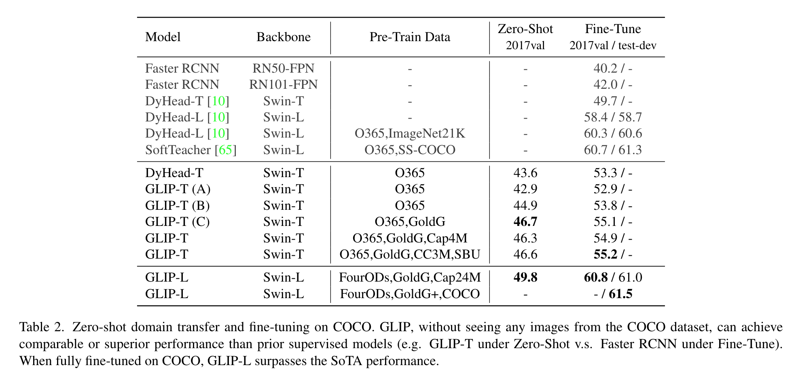

**(논문 요약) Grounded Language-Image Pre-training** [(Paper)](https://arxiv.org/pdf/2112.03857)

## 핵심 내용
- prompt 로 detect.

- 학습 방법
   - image + bbox + prompt 가 주어짐.
   - 각 prompt 와 object region 에 대해서 align 하여 학습.
     - COCO style: Person. Bicycle. ... Hairdryer.
     - text: A woman holds a blow dryer, wearing protective goggles
     - alignment 정보는 bbox 가 가지고 있음 (location, cateogry).
   - feature fusion 부분이 있음. 

- 학습 데이터: 3M human-annotated + (pseudolabeled) 24M web-crawled image-text pairs

## 실험 결과
- 데이터
   - O365 (Objects365): 0.66M images, 365 categories
   - GoldG: 0.8M human-annotated data
   - Flickr30K: image-text data
   - VG Caption: image-text data
   - Cap4M: image-text data (4M pairs)
   - CC3M: image-text data
   - SBU: image-text data

