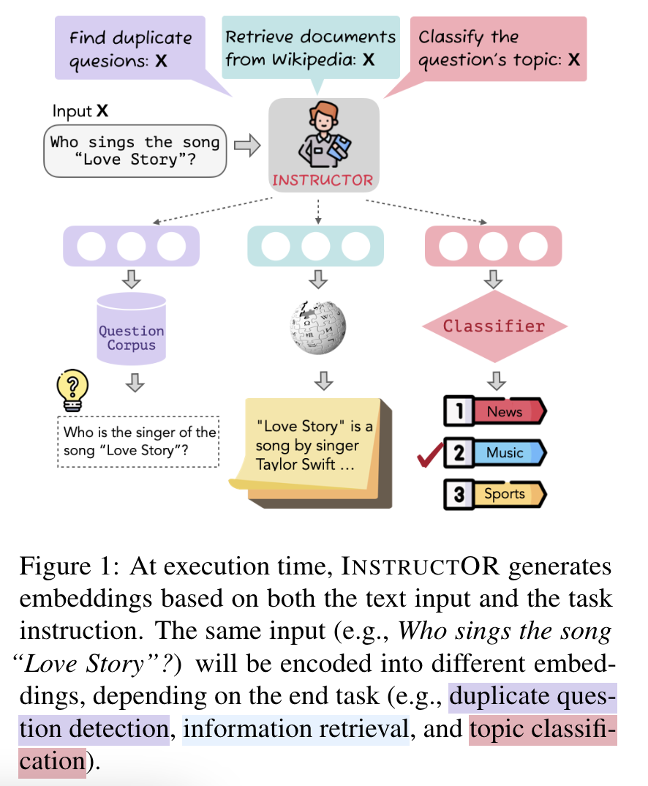
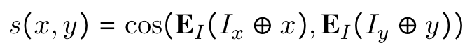
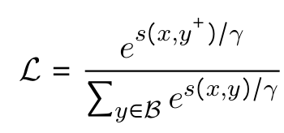
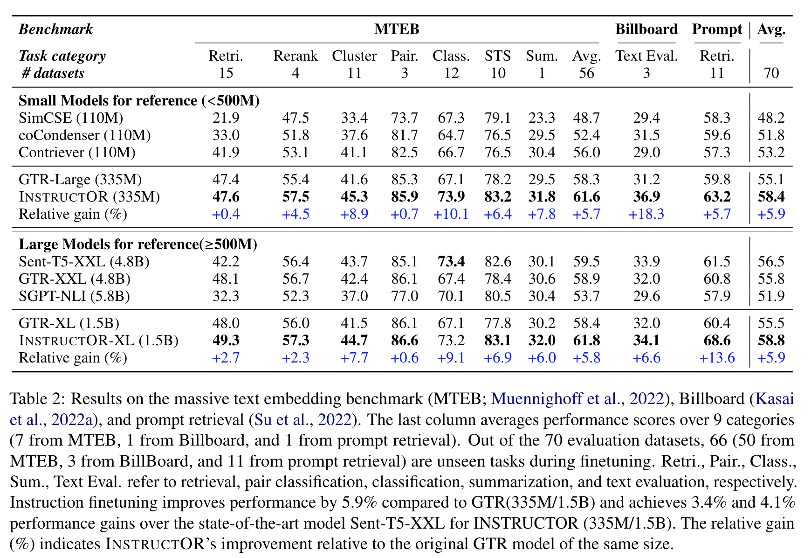

**(논문 요약) One Embedder, Any Task: Instruction-Finetuned Text Embeddings** [(Paper)](https://arxiv.org/pdf/2212.09741)

## 핵심 내용

- Method: Input text 를 task 에 따라 다르게 embedding  

- Contrastive loss 사용. instruction 과 text 를 concat 해서 embedding.
   - score 정의: 
   - open-domain QA 의 경우, 
      - $I_x$: “Represent the Wikipedia question for retrieving supporting documents; Input: ” 
      - $I_y$: “Represent the Wikipedia document for retrieval; Input: ”   
   - loss:   

## 실험
- GTR 모델들에서 추가 학습하여 성능 비교.  

