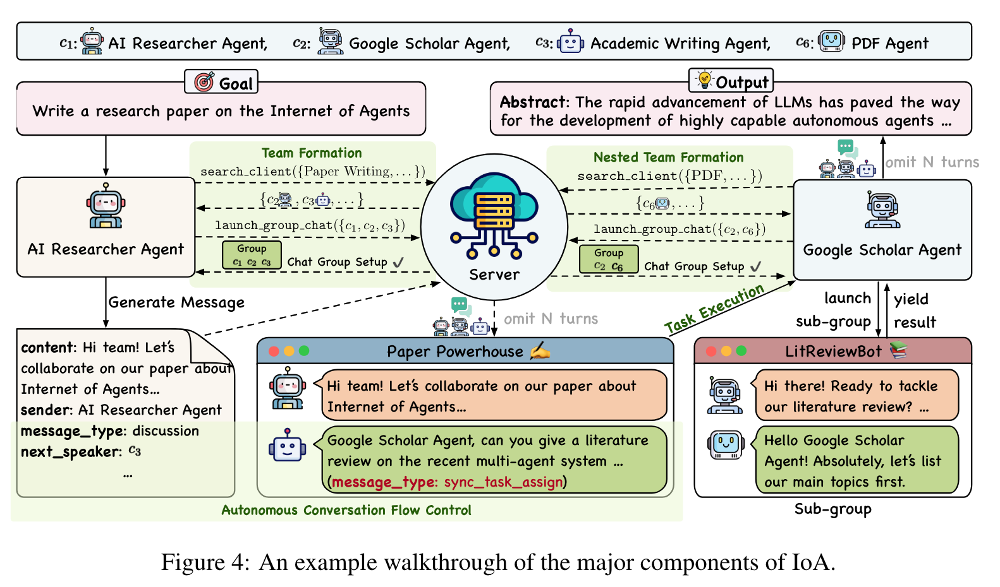
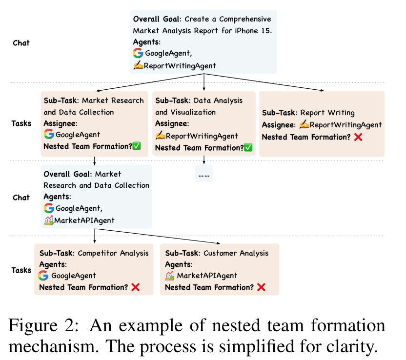
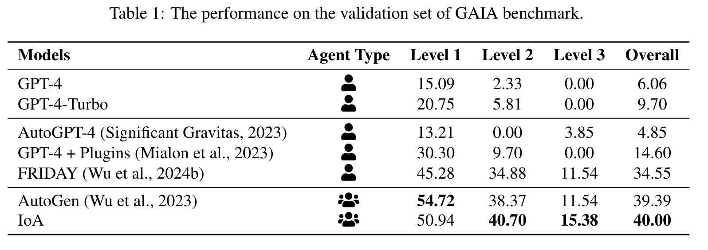

**(논문 요약) INTERNET OF AGENTS: WEAVING A WEB OF HETEROGENEOUS AGENTS FOR COLLABORATIVE INTELLIGENCE** [(Paper)](https://www.arxiv.org/pdf/2407.07061)

## 핵심 내용
- Server 는 client (chatbot) 의 request 해결
- request 예시: query 에 맞는 agent 목록 조회, chatbot group chat 개설  

- team formation: split task to subtasks and assign them     

## 실험 결과
- agent benchmark 에서 SOTA  

