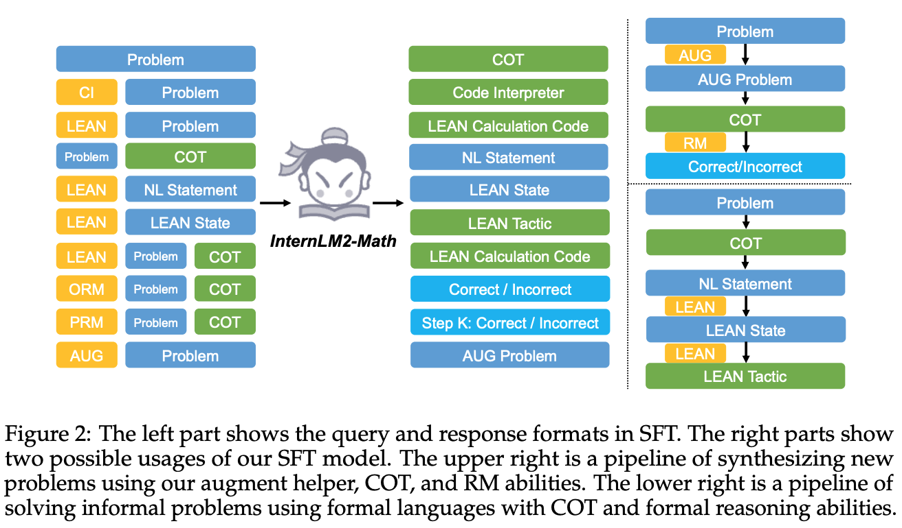
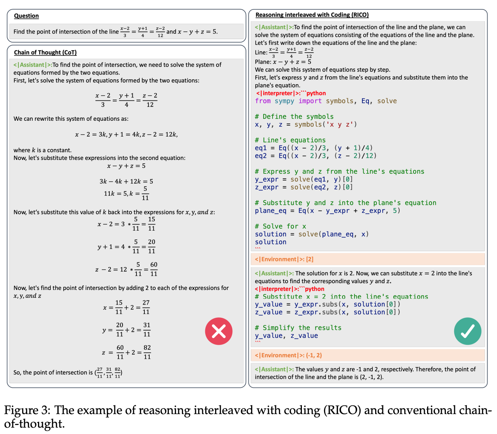
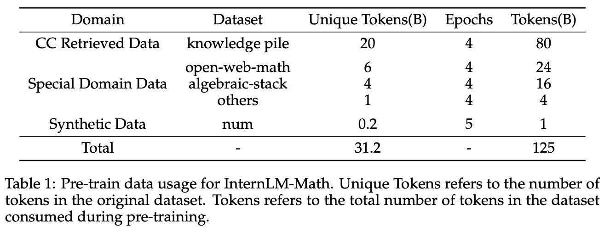
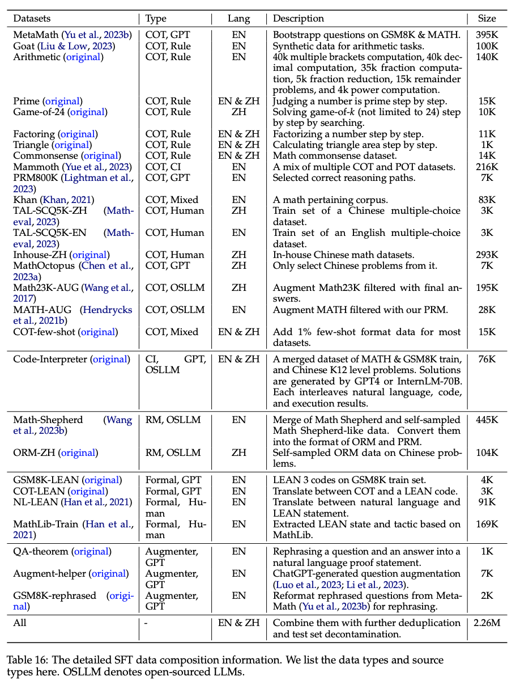
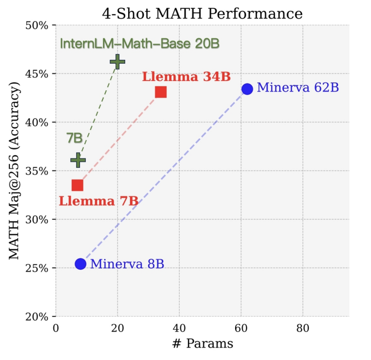

**(논문 요약) InternLM-Math: Open Math Large Language Models Toward Verifiable Reasoning** [(Paper)](https://arxiv.org/pdf/2402.06332.pdf)

## 핵심 내용

- 모델: decoder-only transformer ([InterLM](https://github.com/InternLM/InternLM) 이라는 자체 pretrained LLM)

- 학습:  다양한 task 의 데이터 쌍 학습  (e.g. problem->COT, [aug]+problem->aug-problem)    

- Reasoning interleaved with coding: 작은 문제를 code 로 풀고 결과 취합해서 최종 답 생성     

## 실험
- Pretrain 데이터: filtering, depulication 이후 31.2B tokens   

- SFT 데이터: filtering, depulication 이후 31.2B tokens   

- 타 모델과 비교  

