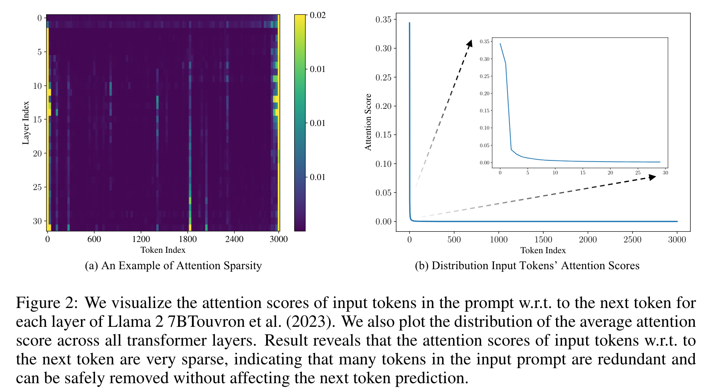

**(논문 요약) LazyLLM: DYNAMIC TOKEN PRUNING FOR EFFICIENT LONG CONTEXT LLM INFERENCE** [(Paper)](https://arxiv.org/pdf/2407.14057)

## 배경 지식
- Prefilling 은 user input 의 self-attention, decoding 은 new token 생성하는 과정을 말함  

## 핵심 내용
- 첫번째 token 생성시 user input 의 모든 token 을 참조하지 않음  

- algorithm
   - self-attention 을 계산할 token 의 위치의 숫자를 layer 단위로 점진적으로 줄여나가되 (attention Top-k percentile 남김), Cache 와 Aux cache 를 활용하여 필요한 tensor 를 필요에 따라 가져옴
   

## 실험 결과
- inference 예시  

- random token dropping 이나 static pruning 보다 성능이 좋음  

- low layer 에서 pruning 은 성능 저하를 야기하나, high layer 에서는 성능저하가 거의 없음  

- high layer 에서는 적은 token 만 사용하고, low layer 에서는 전체 token 을 활용  

