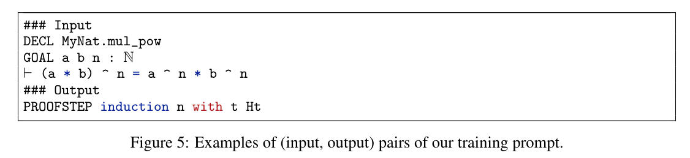

**(논문 요약) LEAN-GitHub: Compiling GitHub LEAN repositories for a versatile LEAN prover** [(Paper)](https://arxiv.org/pdf/2407.17227)

## 핵심 내용
- data 수집 pipeline   

- 타 data 와 비교   

- train
   - InternLM-math-plus-7B 부터 학습 시작 
   - GPT-f format prompting  
   
   - batch size: 512
   - learning rate: 1e-5 (warm-up with 3% steps and then cosine annealing)
   - 2 epochs of SFT
   - ~6 hours on 32 A100 GPUs
   - LEAN4 에서 동일한 intermediate stage 를 통합함 (free variable 을 internal storage order 대로 부여했다고함)
- proof search
   - best-first search
   - validate intermediate proof steps within a formal proof until the proof is either finalized or resources are exhausted
   - max 100 expansions, 32 candidate generations per expansion

## 실험 결과

