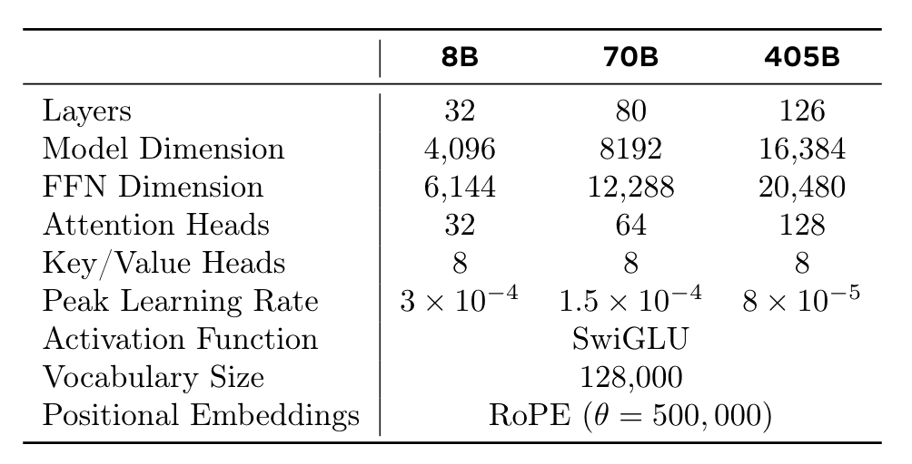
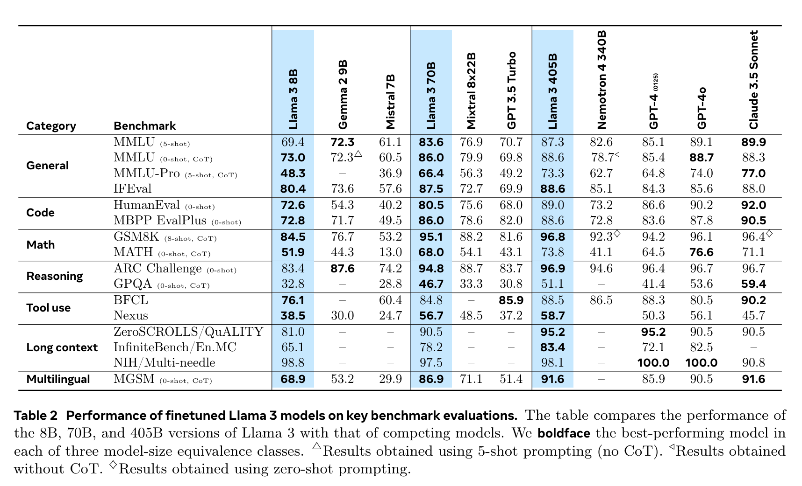

**(논문 요약) The Llama 3 Herd of Models** [(Paper)](https://scontent-ssn1-1.xx.fbcdn.net/v/t39.2365-6/452387774_1036916434819166_4173978747091533306_n.pdf?_nc_cat=104&ccb=1-7&_nc_sid=3c67a6&_nc_ohc=t6egZJ8QdI4Q7kNvgFbZ7Eq&_nc_ht=scontent-ssn1-1.xx&oh=00_AYDp2iSDIdoLSlhL0wSLNFD_tSWxaPFWHj9b9c5LE2PXdQ&oe=66A6B34D)

## 핵심 내용
- param size: 8B, 70B, 405B
- context window: up to 128K
- tokenizer: vocab with 128K tokens (100K tokens from the tiktoken + 28K additional tokens for non-English languages)
- architecture: 단순함을 위하여, Mixture of Experts 사용하지 않고 trasformer decoder 사용   

- pretrain
   - 데이터 개선
      - custom website-filtering
      - custom html parser
      - deduplication with url and Minhash (doc-level) and CCNet (sentence level)
      - heuristic filter of low quality texts: log, error message, slangs, documents with outlier-vocabularies
      - classifier-based filter of low quality texts: fasttext (classify wikitexts) + roberta-based classifier
      - domain specific filtering for code and math data
      - 50% of tokens - general knowledge, 25% - mathematical and reasoning, 17% - code , 8% - multilingual.
    - scaling law  
    
    
    - 학습시 tensor parallelism, pipeline parallelism, context parallelism, data parallelism 활용  
    
    
    - (1) initial pre-training, (2) long-context pre-training, (3) annealing (data upsampling, weight average) 으로 진행 
- post-training
  - rejection sampling: 모델의 output 중 Reward Model 로 평가했을때 가장 좋은것을 취득. Reward Model 은 humman annotated data 로 학습 (edited > chosen > rejected)
  - code data
     - 데이터 생성: code snippet 을 prompt 로 하여 문제 생성. 그 문제를 풀게함. static analysis (직접 돌려봄) 과 unit-test 를 (생성하여) 통과할때까지 conversation 한 뒤, 데이터에 포함시킴
     - 코드 번역: python (common) -> php (rare)
     - 주석: original code -> generated 주석 -> generated code 를 돌리고, 이 3개를 모델에 주고 주석이 잘 쓰여졌는지 물어본 뒤, 확신도가 높은 것만 SFT 데이터로 활용
  - reasoning data 는 모델을 활용하여 logical step 이 맞는지 판별하여 데이터 확보 
  - tool use 는 모델을 학습하여 데이터 생성후, 실제로 돌려서 맞는것만 데이터로 추가 

## 실험 결과

