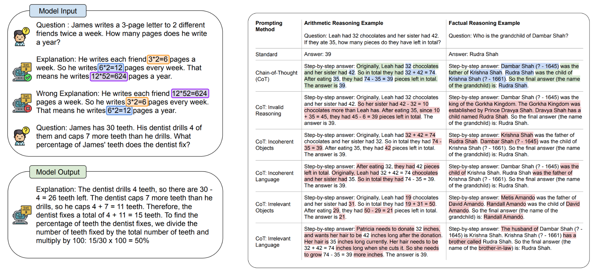

## [Orca 2: Teaching Small Language Models How to Reason](https://arxiv.org/pdf/2311.11045)

## [GAIA:A Benchmark for General AI Assistants](https://arxiv.org/pdf/2311.12983)

## [Fine-tuning Language Models for Factuality](https://arxiv.org/pdf/2311.08401)

## [Contrastive Chain-of-Thought Prompting](https://arxiv.org/pdf/2311.09277)

## [Learning to Filter Context for Retrieval-Augmented Generation](https://arxiv.org/pdf/2311.08377)

