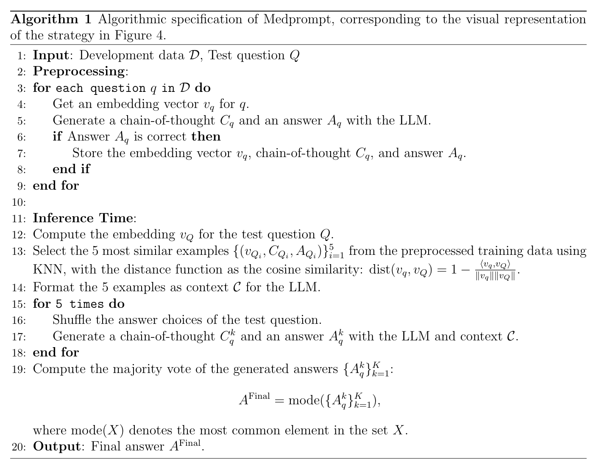
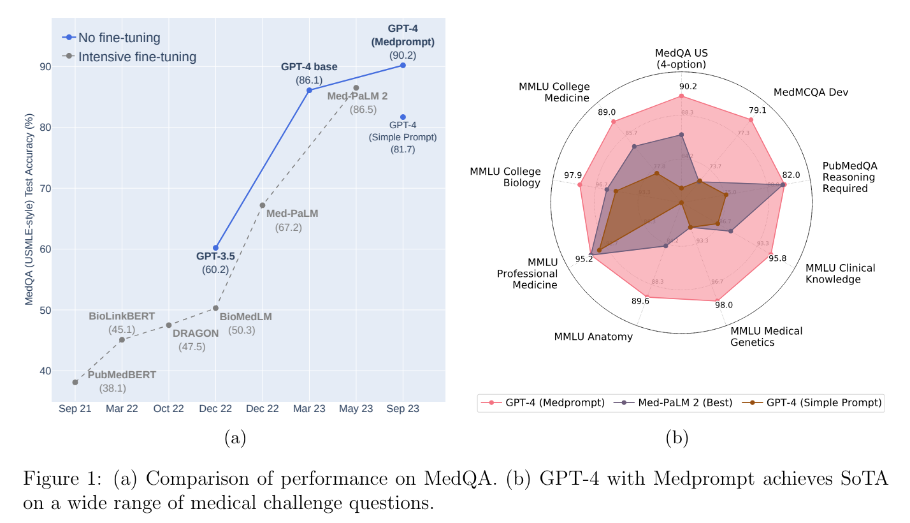

**(논문 요약) Can Generalist Foundation Models Outcompete Special-Purpose Tuning? Case Study in Medicine** [(Paper)](https://arxiv.org/pdf/2311.16452)

## 핵심 내용
- random few-shot: training data 에서 샘플
- chain-of-thought: GPT4 에 query 로 chain-of-thought data 확보
- kNN: query 의 embedding 과 비슷한 k(=5) 개 few-shot
- ensemble with choice shuffle: 문항 순서 shuffle 하면서 output 생성 후 ensemble

- 알고리즘  

## 실험 결과
- 데이터
   - MedQA: multiple choice questions in the style of the Medical Licensing Examination questions
   - MedMCQA: mock and historic exam questions in the style of two Indian medical school entrance exams—the AIIMS and NEET-PG
   - PubMedQA: a yes, no, or maybe answer to biomedical research questions when given context provided from PubMed abstracts

