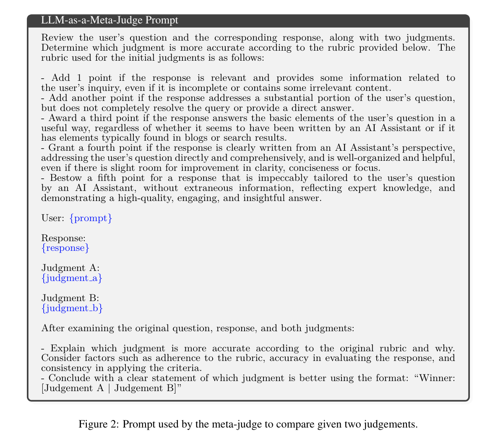

**(논문 요약) META-REWARDING LANGUAGE MODELS: Self-Improving Alignment with LLM-as-a-Meta-Judge** [(Paper)](https://arxiv.org/pdf/2407.19594)

## 핵심 내용
- 같은 LLM 으로, generation (actor) 과 evaluation (judge), meta evaluation (meta-judge) 의 역할을 하여 데이터 수집
  - generation data 의 preference data
  - evaluation data 의 preference data   

- Prompt  
  - judge   
    
  - meta-judge   
    

## 실험 결과
- length control, position preference 를 해결하기 위한 heuristic 을 사용하였고, iteration 4까지 학습함  

   - Iter 1 (M1): DPO (initialized from the SFT model) on both actor and judge preference pairs generated by the SFT model
   - Iter 2 (M2): DPO (from M1) on actor and judge preference pairs generated by M1
   - Iter 3 (M3): DPO (from M2) exclusively on actor preference pairs generated by M2
   - Iter 4 (M4): DPO (from M3) exclusively on actor preference pairs generated by M3