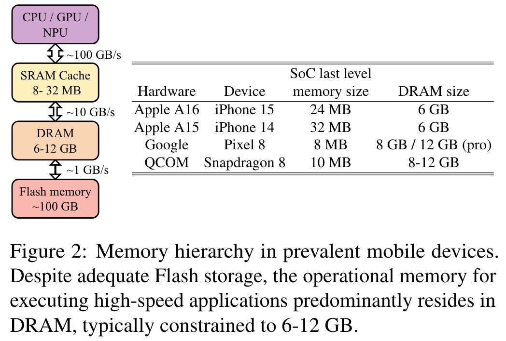
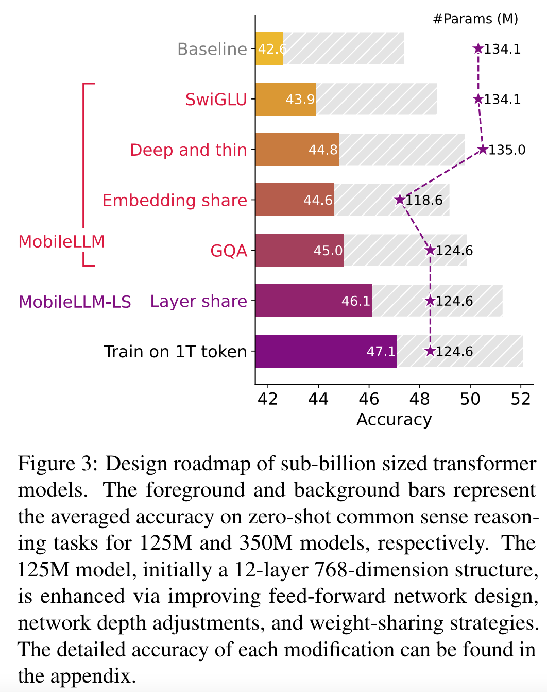
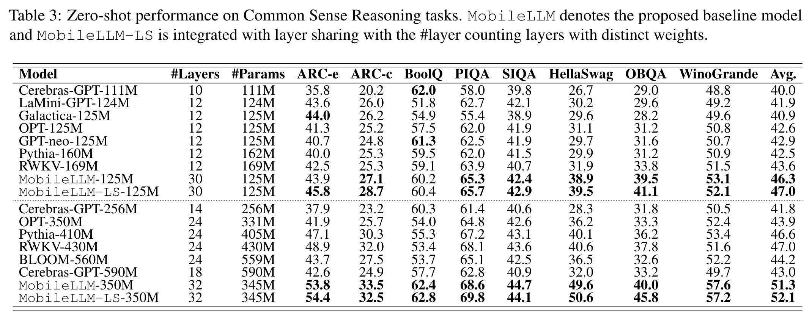

**(논문 요약) MobileLLM: Optimizing Sub-billion Parameter Language Models for On-Device Use Cases** [(Paper)](https://arxiv.org/pdf/2402.14905)

## Motivation
- mobile device 는 hardware 제약이 있음  

## 핵심 내용
- 성능을 올리기 위해 하나씩 ablation  

  - SwiGLU: FFN (FC-ReLU-FC) 를 SwiGLU 로 대체
  - Deep and thin: 12 layers 를 30~42 layers 로 늘임 (feature dimension 을 줄임)
  - Embedding share: input embedding layer 와 softmax 이전 layer 를 공유
  - GQA: Multi-Head Self-Attention 을 Gruoped Query Attention 으로 교체 
  - Layer share: weight 를 layer 별로 2번 사용 (e.g. $i$번째 $i+1$번째 layer weight share)
  - Train on 1T tokens: 모델 최적화 이후, 1T token 추가 학습

## 실험 결과
- 작은 모델중에서는 우수하나 large model 에 미치지 못함 (HellaSwag 의 경우, GPT4-10shots 는 95.3)    

