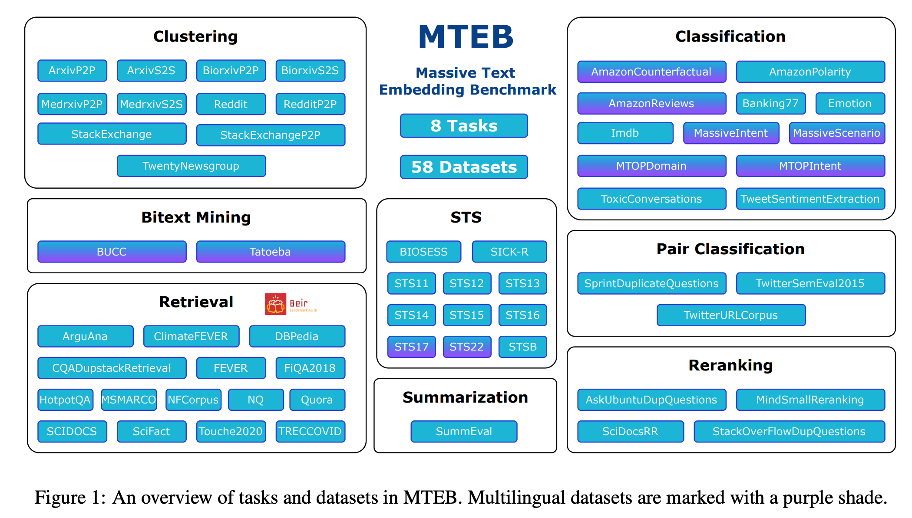

**(논문 요약) MTEB: Massive Text Embedding Benchmark** [(Paper)](https://arxiv.org/pdf/2210.07316.pdf)

## 핵심 내용
- Massive Text Embedding Benchmark (MTEB)
   - 8 embedding tasks
   - 58 datasets 
   - 112 languages.
- Task
   - Bitext Mining: 언어 A 의 문장들, 언어 B 의 문장들을 embed 후, cosine similarity 로 matching.  
   - Classification: train, test set 의 embedding 구해놓고, train 으로 classifer 학습 후 test 성능 측정.  
   - Clustering: embed 이후 레이블 개수 만큼 cluster (fixed clustering algorithm 으로 학습). 
   - Pair Classification: 2개 문장이 같은 의미인지 수치로 계산.
   - Reranking: query 와의 연관성에 따라 reference documents 를 줄세움.
   - Retrieval: query 와 연관된 documents 를 찾음.
   - Semantic Textual Similarity: 2개 문장의 유사도를 수치로 계산.
   - Summarization: 사람이 쓴 paragraph 와 기계가 요약한 summary 와의 유사도 계산.

   - varying lengths
     - Sentence to sentence (S2S)
     - Paragraph to paragraph (P2P)
     - Sentence to paragraph (S2P)
