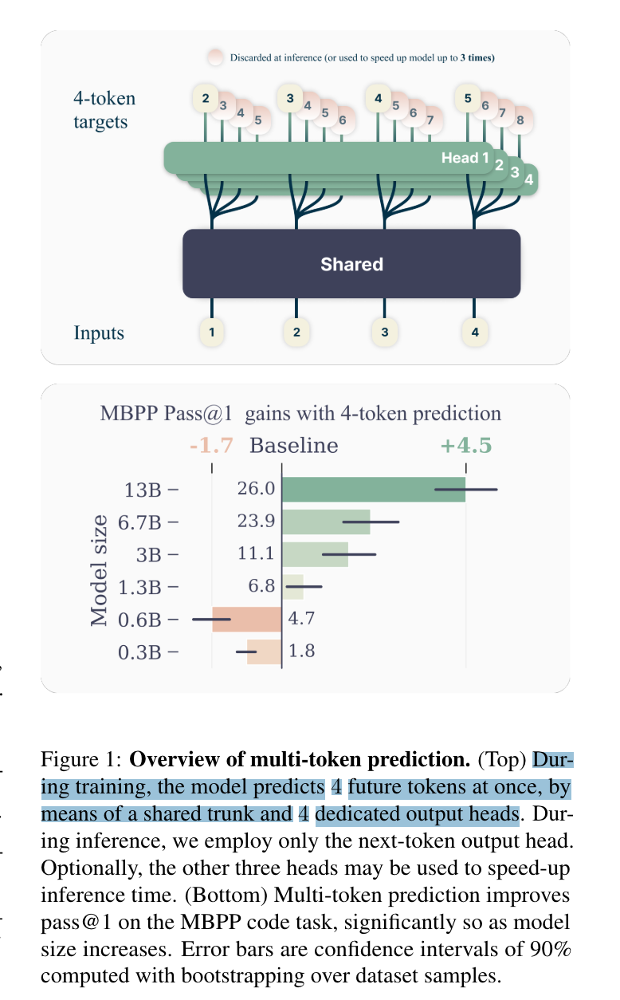
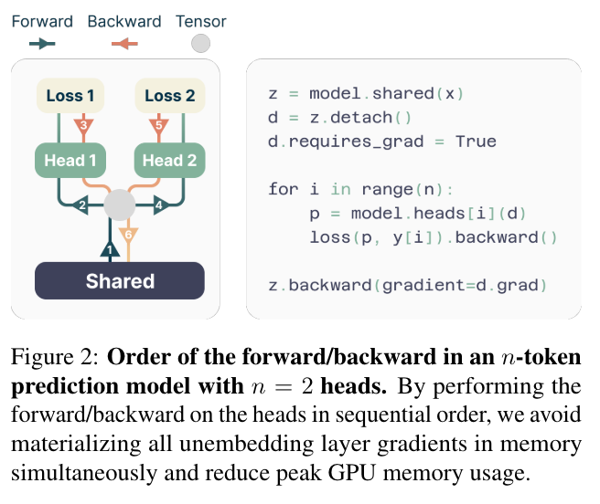
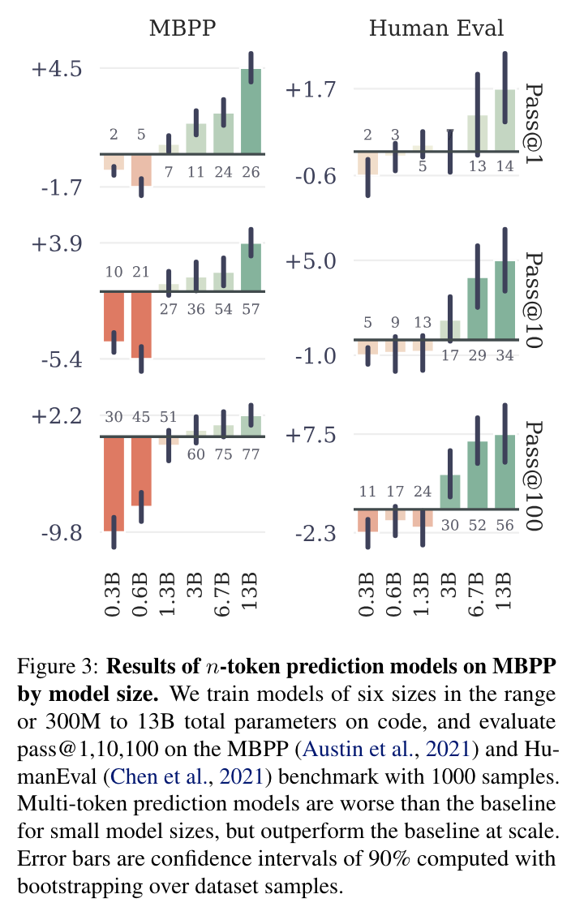
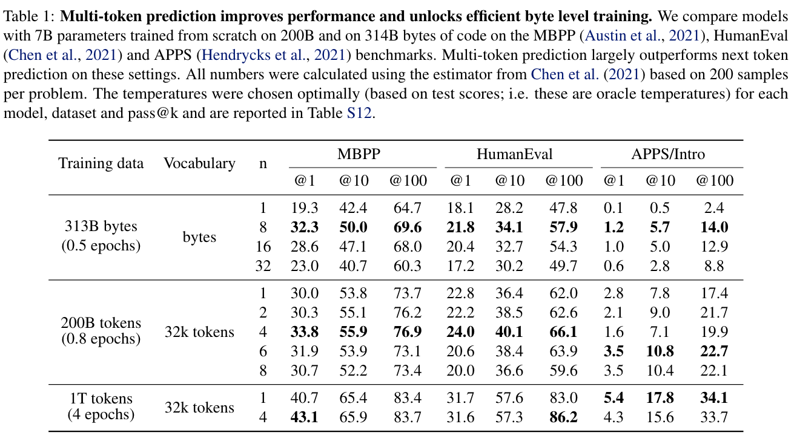

**(논문 요약) Better & Faster Large Language Models via Multi-token Prediction** [(Paper)](https://arxiv.org/pdf/2404.19737)

## 핵심 내용
- n 개 token 예측하도록 학습. 학습시엔 각 head 별로 forward, backward 이후, shared backward.  

## 실험 결과
- 작은 모델 (0.x B params) 에서는 성능 하락. 큰 모델 (> 3B) 에서는 성능 향상.  

