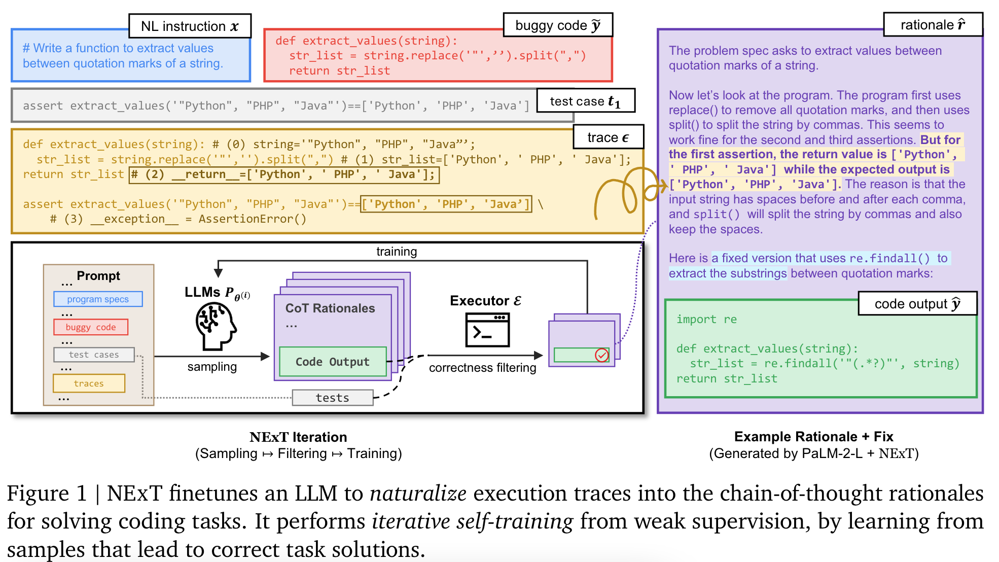

**(논문 요약) NExT: Teaching Large Language Models to Reason about Code Execution** [(Paper)](https://arxiv.org/pdf/2404.14662)

## 핵심 내용

- Method: 코드에 에러가 있을때, rationale 과 새로운 코드 생성. 생성된 코드가 테스트를 다 통과하면 학습 데이터에 추가.

   - execution trace 예시  
    
   - 알고리즘   
    
      - line1 에서 hard data $\mathcal{D}_H$ 수집 시, pass@1 estimated with 32 samples as the filtering metric $\mathcal{M}$ ($m=0.1$)
      - line4 에서 32개 sample.
      
## 실험
- 모델: PaLM 2-L 사용.
- 데이터: 기존 benchmark 를 수정하여 사용.
  - Mbpp-R: Mbpp + LLM-generated incorrect code solutions (10,047 repair tasks for training and 1,468 tasks in the development for evaluation).
  - HeFix+: HumanEvalFix (164 buggy programs) + rigorous test suites from EvalPlus.
  

