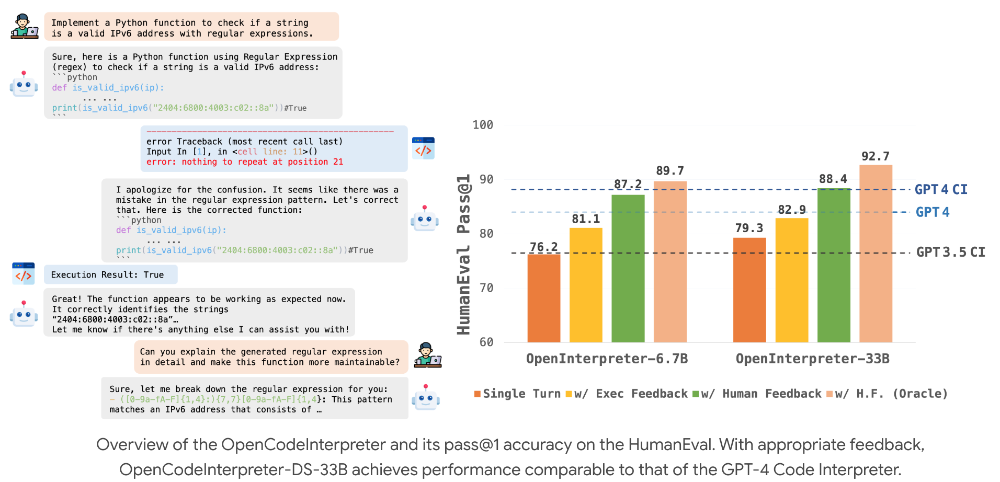
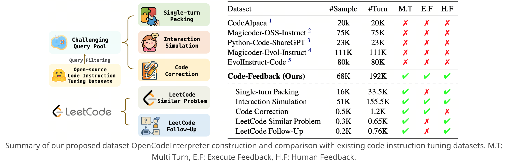

**(논문 요약) Integrating Code Generation with Execution and Refinement** [(Paper)](https://opencodeinterpreter.github.io/)

## 핵심 내용

- 컨셉: 코드 실행 환경, Executation feedback 제공하여 multi-turn 으로 문제 해결.

- 데이터 수집: Multi Turn, Execute Feedback, Human Feedback 을 골고루 만족하는 데이터 구축.

## [실험](https://opencodeinterpreter.github.io/)