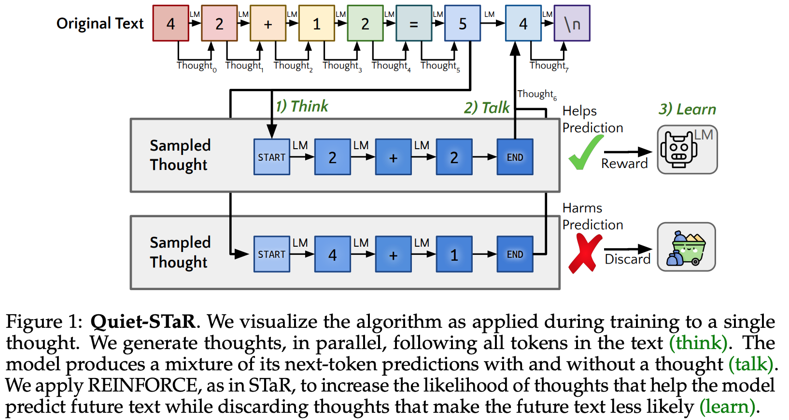
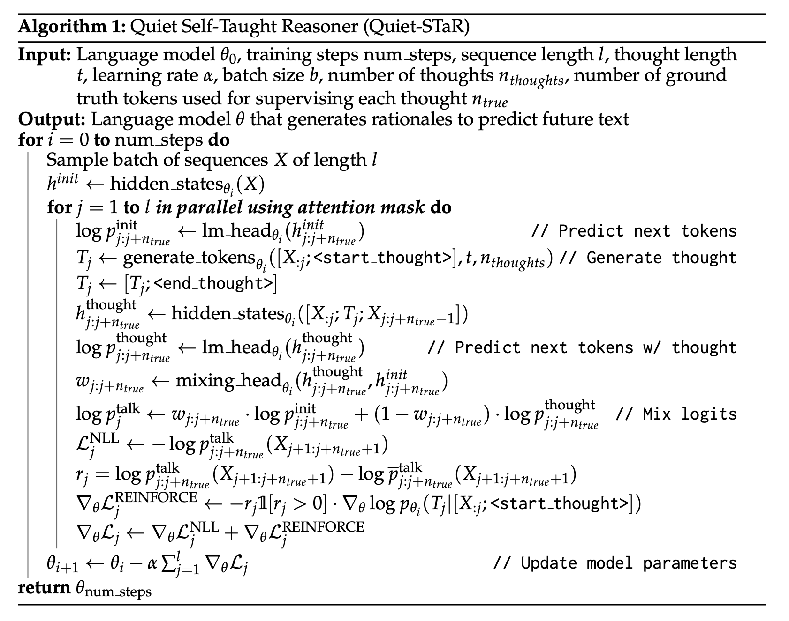
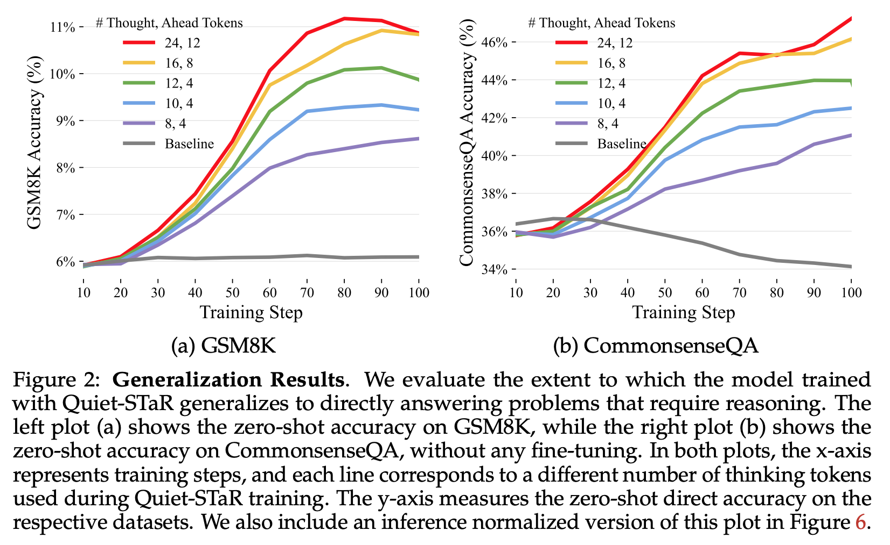

**(논문 요약) Quiet-STaR: Language Models Can Teach Themselves to Think Before Speaking** [(Paper)](https://arxiv.org/pdf/2403.09629.pdf)

## 핵심 내용
- 목표: Next token 생성시, think 과정을 넣음.

- 알고리즘: 
  - (default) next token probability with autoregressive generation: $p_{j:j+n_{true}}^{init}$
  - next token probability with thoughts: $p_{j:j+n_{true}}^{thought}$
  - $p_{j:j+n_{true}}^{init}$ 와 $p_{j:j+n_{true}}^{thought}$ 의 비율을 조절하는 부분 (mixing_head$_{\theta_i}$) 학습.
  - $p_{j:j+n_{true}}^{talk}$ 의 NLL loss 계산.
  - $p_{j:j+n_{true}}^{talk}$ 에서 평균 ($\bar p_{j:j+n_{true}}^{talk}$) 빼주고 REINFORCE loss 계산.

- 결과: QA 데이터에서 성능 향상.

