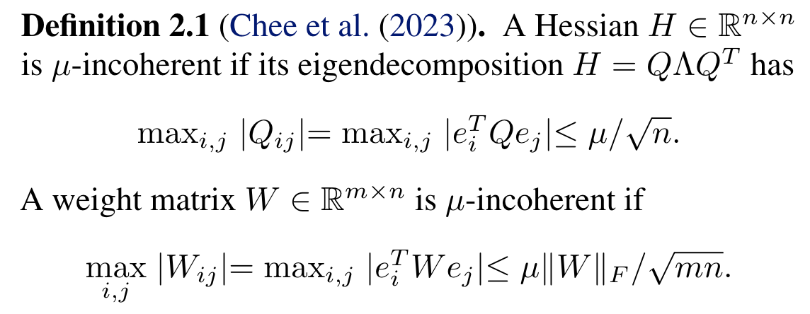
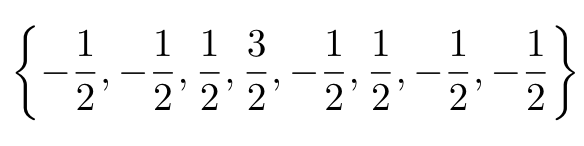

**[(논문 요약) QuIP#: Even Better LLM Quantization with Hadamard Incoherence and Lattice Codebooks](https://arxiv.org/pdf/2402.04396)**

## 핵심 내용
1. randomized Hadamard transform
2. codebooks based on the highly symmetric E8 lattice
3. fine-tuning
- pipeline   

## Notations
- 보통 weight quantization 은 per-layer proxy loss 를 최소화 ($x$ 는 calibration set 이용, $H = E[xx^T]$)

- 논문에서 incoherence 의 정의    

- Randomized Hadamard Transform 으로 incoherence 개선  

## 알고리즘

- Random Hadamard Transform
  - $x \rightarrow VSx$ where $V\in R^{n\times n}$ is a Hadamard matrix, $S\in R^{n\times n}$ is a random diagonal matrix with element ±1, $x\in R^n$
- LDLQ algorithm
   - $H = L^TDL$
   - $U = L^T - I$ is a upper triangle matrix
   - $\hat{W} = quantize(W + (W − \hat{W} )U)$
- BlockLDLQ 는 contiguous column block 을 LDLQ    
   -   
   - $A_k\in R^{n\times g}$ is $k-g+1 \sim k$ column of $U$
   - $W_k\in R^{m\times g}$ is $k$th block of $W\in R^{m\times n}$
- E8 lattice
   - $E_8$: 원소가 정수 혹은 정수+0.5 이고, 합이 짝수    
   -   
   - encoding 편의상 $E_8$+1/4 사용 (자세한 내용 논문 4.2 참조)
   - 절대값만 codebook 으로 저장 - (227 elements with norm $<\sqrt{10}$ and 29 with norm $\sqrt{12}$)
- E8P 예시: 16 bit 의 0001010110010111  
   - 앞의 00010101=21 은 21 번째 code 를 의미  
   -   
   - 그 다음의 1001011는 sign flip 여부를 의미 (s 를 다 더하면 홀수이므로 맨 앞 숫자는 sign flip 필요)
   -   
   - 마지막 bit 1 은 +1/4 를 의미 (0 인경우, -1/4)
   -   
- Finetuning  (minimize activation error between quantized layer/model and unquantized layer/model)  
   - Using a development set, relax the sign vectors in the RHT to arbitrary real vectors
   - Works in 2 steps
   (1) For each transformer block, quantize the first linear layer, fine-tuning the remaining parameters, quantize the second linear layer, and so on up to the last layer.
   (2) fine tune layernorms, sign vectors, language model head

## 실험 결과
- QuIP# 이 QuIP, AQLM 보다 나음 (2 bit 까지 quantize)  
  
- E8P 가 multivariate Gaussian 을 더 잘 quantize  
  
- performance
  