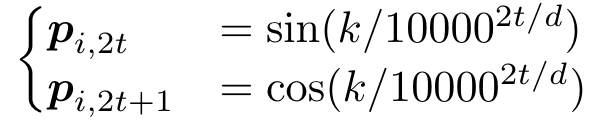
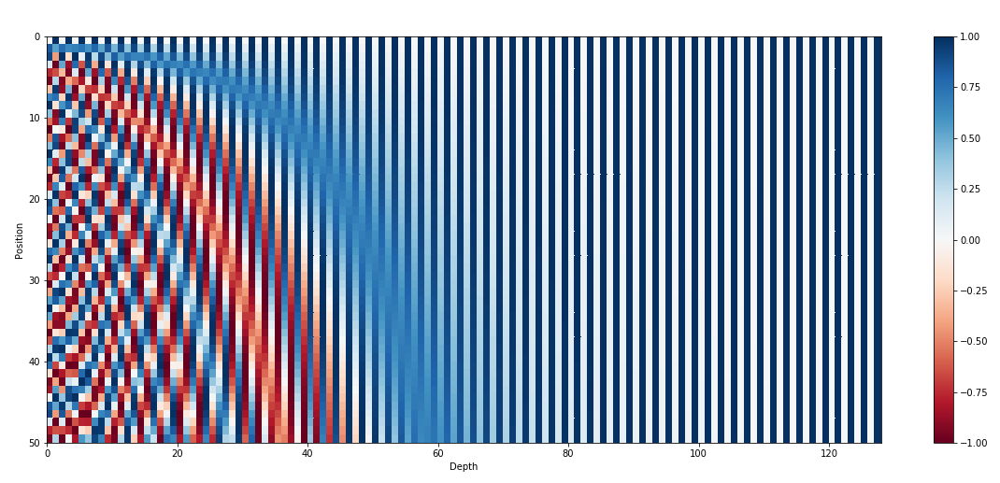
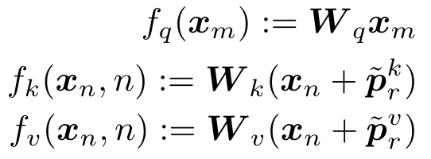
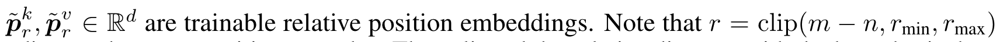
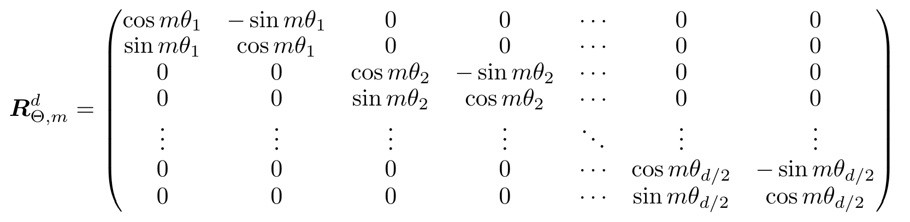
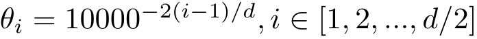
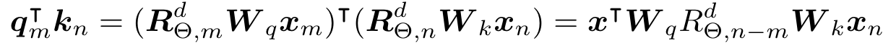
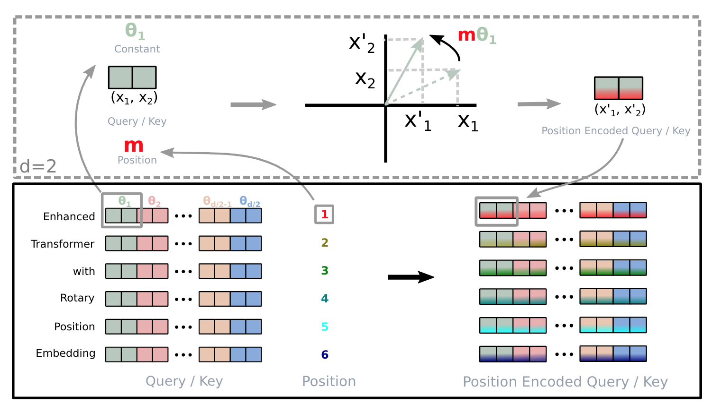
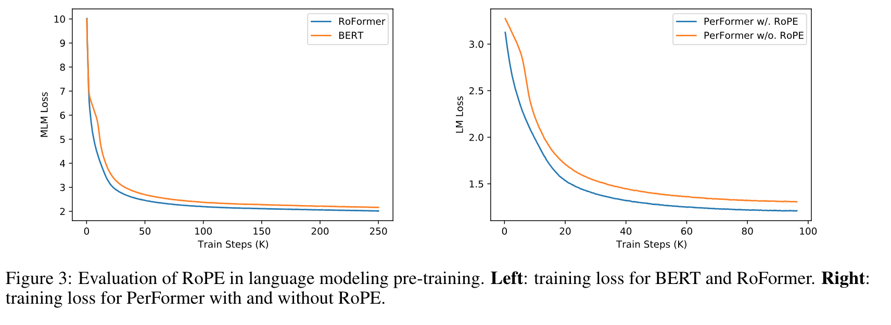

**(논문 요약) ROFORMER: ENHANCED TRANSFORMER WITH ROTARY** [(Paper)](https://arxiv.org/pdf/2104.09864)

## 핵심 내용
- position embedding: $p_i\in \\{p_t\\}_{t=1}^L$
- absolute position embedding: 각 dimension 이 홀수, 짝수일때 다르게 정의됨   

- relative position embedding: query 의 position을 $m$, key 와 value 의 position이 $n$ 일때,   

- rotary position embedding: $(m-n)*\theta_i$ 만큼 rotation  

 로 정의시 $m-n$ 이 클수록 inner product 작아진다고 함   
   - self-attention:  

## 실험 결과
- position embedding 만 바꿔도 성능이 향상됨

