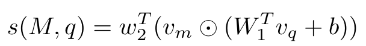

**(논문 요약) RouteLLM: Learning to Route LLMs with Preference Data** [(Paper)](https://arxiv.org/pdf/2406.18665)

## 핵심 내용
- 비싸고 성능 좋은 모델 (e.g. gpt4) 과 싸고 성능이 덜 좋은 모델 (e.g. Mixtral-8x7B) 을 query 에 따라 routing 하여 성능은 유지하면서 비용을 최소화  
- 모델이 2개인 경우, preference data 사용 가능
  - Chatbot arena data (direct comparison)
  - GT based preference data (correct preferred)
- random 하게 route 하는 것보다, 비싼 모델을 덜쓰면서 비슷한 성능을 낼수 있음   

   - Matrix Factorization: model score 
       - $w_2, W_1, b$: trainable parameters
       - $v_m$: model embedding
       - $v_q$: query embedding
   - CausalLLM: Llama 3 8B
