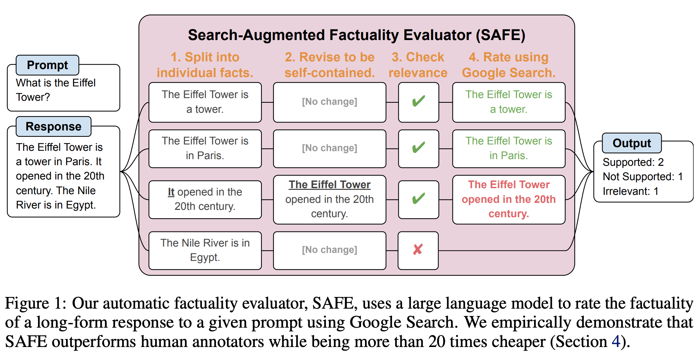
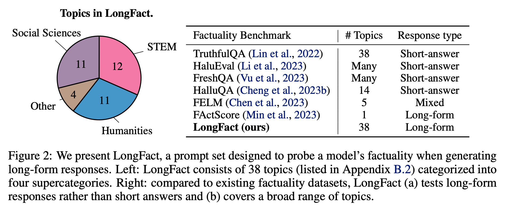
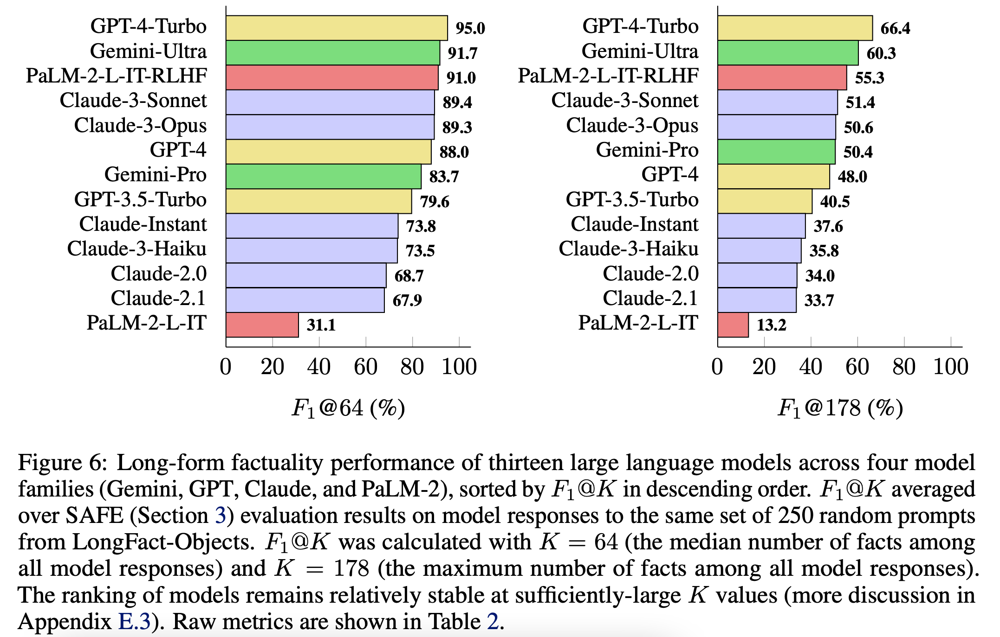

**(논문 요약) LONG-FORM FACTUALITY IN LARGE LANGUAGE MODELS** [(Paper)](https://arxiv.org/pdf/2403.18802.pdf)

## 핵심 내용
- Overview  

- Data  

- Result  
  - 큰 모델일수록 factuality 성능이 좋음.
  - recall 은 min(|#fact|/K, 1) , K=64, 178 로 계산하여 F1 구함.    

