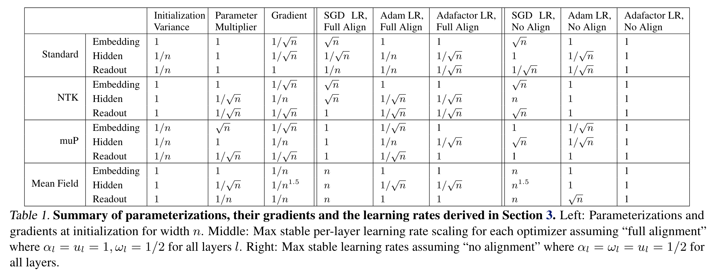
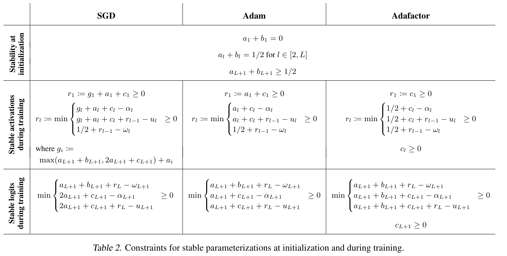
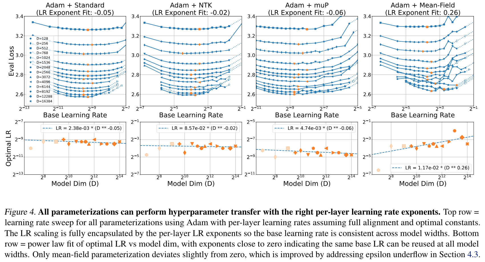
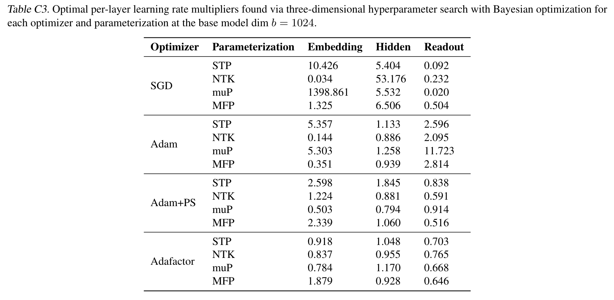

**(논문 요약) Scaling Exponents Across Parameterizations and Optimizers** [(Paper)](https://arxiv.org/pdf/2407.05872)

## 핵심 내용
- NanoDO decoder-only Transformer architecture 를 활용한 hyper-parameter 실험 
- Parameters
   - $n$: width (channel 개수)
   - parameter multiplier $a_l$: $n^{-a_l}$
   - parameter initialization $b_l$: $W_l\sim\mathcal{N}(0, n^{-2b_l})$
   - learning rate constant $c_l$: learning rate $\eta_l\propto n^{-c_l}$

   
- stability constraint 가 다음과 같이 주어진다고 함 (detail 은 논문 appendix 에...)  

## 실험 결과
- learning rate $\eta_l \sim \beta_n * \gamma_l * n^{-c_l}$ 으로 정의
   - $\beta_n$ 최적값은 width 에 상관없이 일정하게 나옴  

- $\gamma_l$ 은 embedding layer, hidden layer, readout (마지막) layer 3 종류로 나눈 뒤, Bayesian Optimization 을 돌렸다고 함
   - 하지만, optimizer 별, parameterization 별, layer 별 경향성이 딱히 보이지는 않는 듯함   

