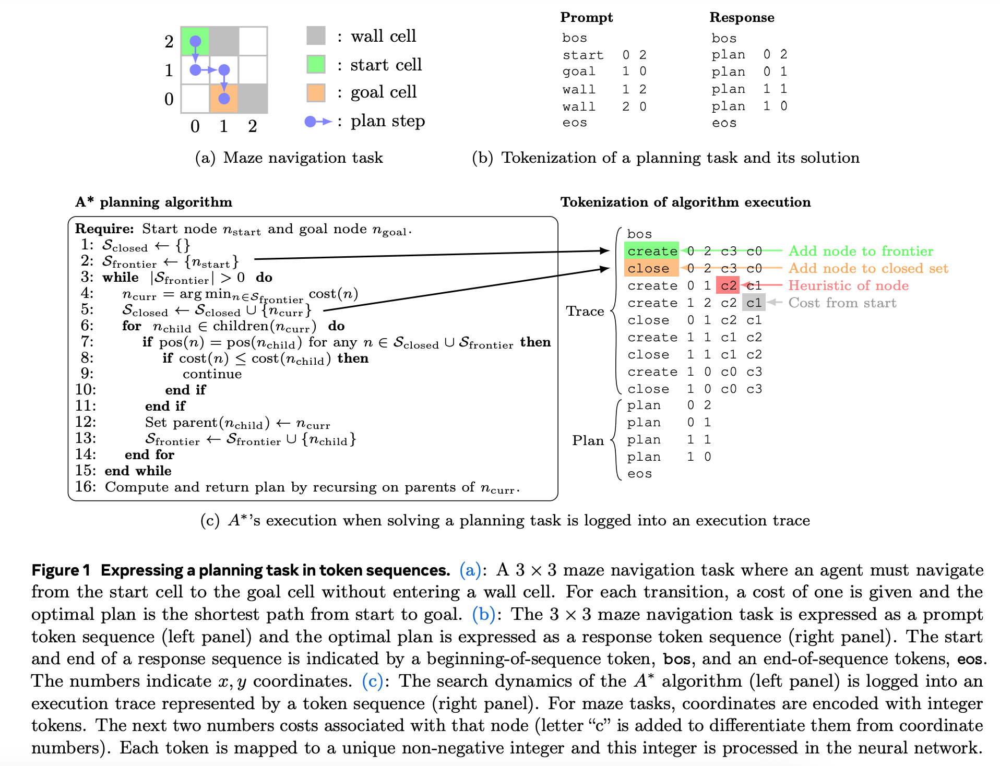
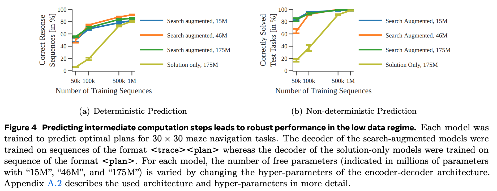

**(논문 요약) Beyond A\*: Better Planning with Transformers via Search Dynamics Bootstrapping** [(Paper)](https://arxiv.org/pdf/2402.14083.pdf)

## 핵심 내용
- 한줄 요약: A\* trace 를 transformer 로 학습해서 미로 찾기 성능을 개선시킬수 있다.   
- 모델: encoder-decoder T5 transformer  
  - encoder: ```<prompt>``` 파트 입력
  - decoder: ```<trace><plan>``` 파트 혹은 ```<plan>``` 파트 생성 및 입력

- 학습: <span style="color:red"> (1) predict A\*'s search dynamic (2) reduce steps via [expert iterations](https://arxiv.org/pdf/2308.08998.pdf) </span>    



## 실험
- Search-augmented sequence: trace 가 포함됨 (```<prompt><trace><plan>``` 파트 전부 사용)   
- Solution-only sequence: ```<prompt><plan>``` 파트 사용   

