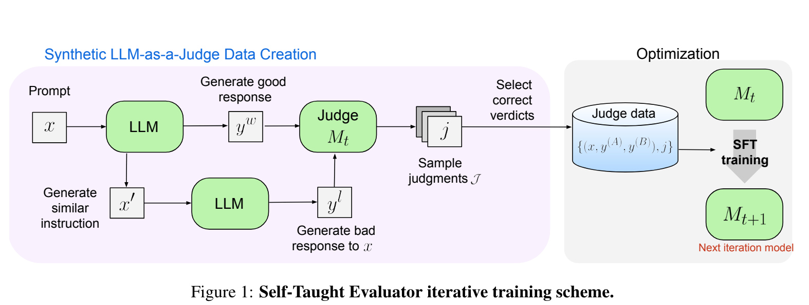

**(논문 요약) Self-Taught Evaluators** [(Paper)](https://arxiv.org/pdf/2408.02666)

## 핵심 내용
- LLM 으로 original prompt ($x$) 에 대한 답변 ($y^w$) 과 덜 정확한 답변 ($y^l$) 의 preference result 를 iteratively 학습  

  - LLM, $M_0$: Mixtral 22Bx8 Instruct
  - $M_{t>0}$: Llama3-70B-Instruct

- $y^l$ 을 생성하기 위한 prompt  

- ($x$, $y^w$, $y^l$) 에 대해서 judge output (N=15) 개 생성 후, $y^w$ 와 $y^l$ 을 제대로 구분한 것 들중 하나를 sample
- $x$ 는 WildChat dataset 에서 가져옴

## 실험 결과

