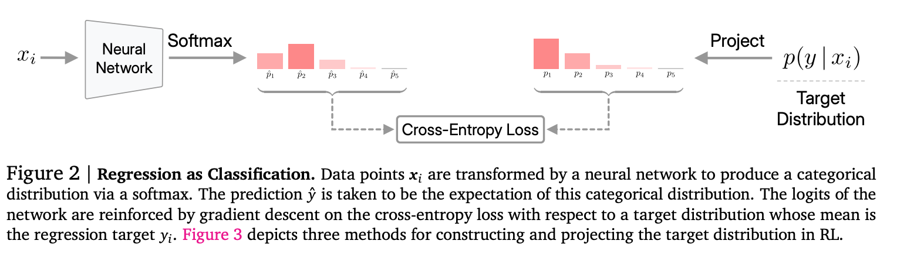
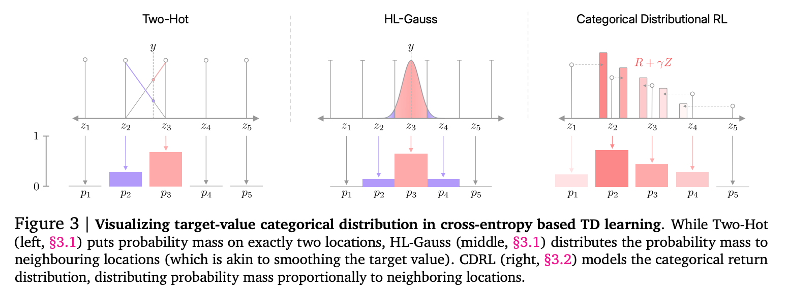
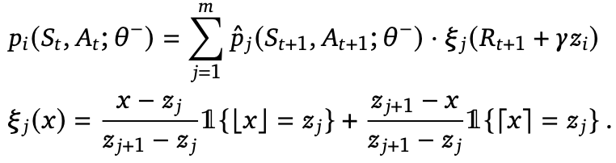
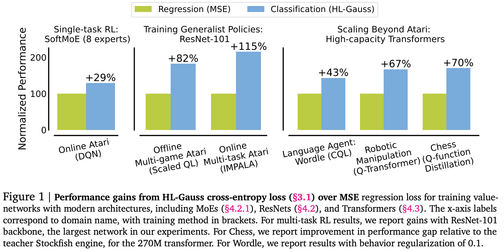

**(논문 요약) Stop Regressing: Training Value Functions via Classification for Scalable Deep RL** [(Paper)](https://arxiv.org/pdf/2403.03950.pdf)

## 핵심 내용
- 문제: *scaling value-based RL methods that use regression to large networks, such as high-capacity Transformers, has proven challenging.*
- 방법: *use classification in place of regression for training*  

- GT: value, distribution 을 category 화.  

  - Categorical Distributional RL 의 경우, 각 가장 가까운 두 지점에 weight 양분.  

- 결과: value 를 regression 할때 보다 성능 개선.  

