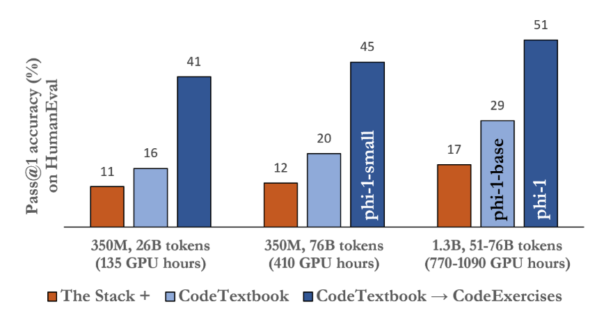
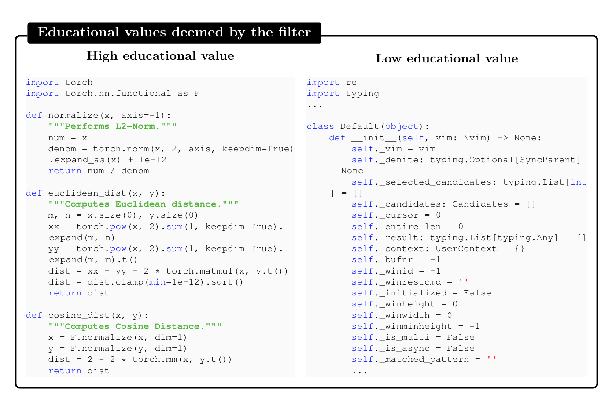
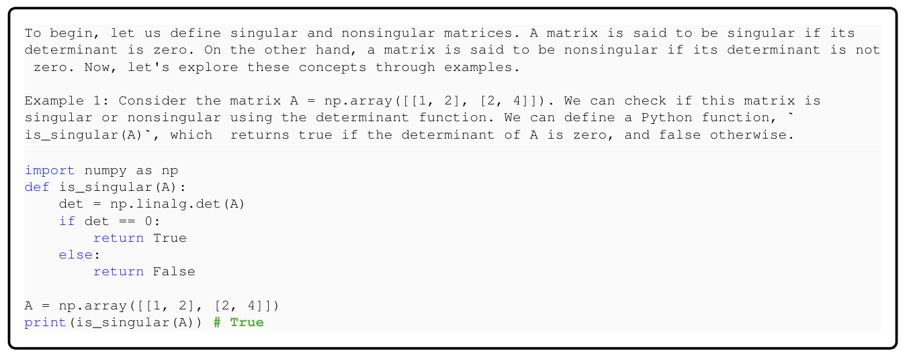
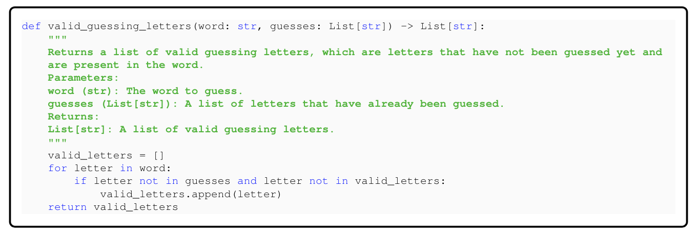
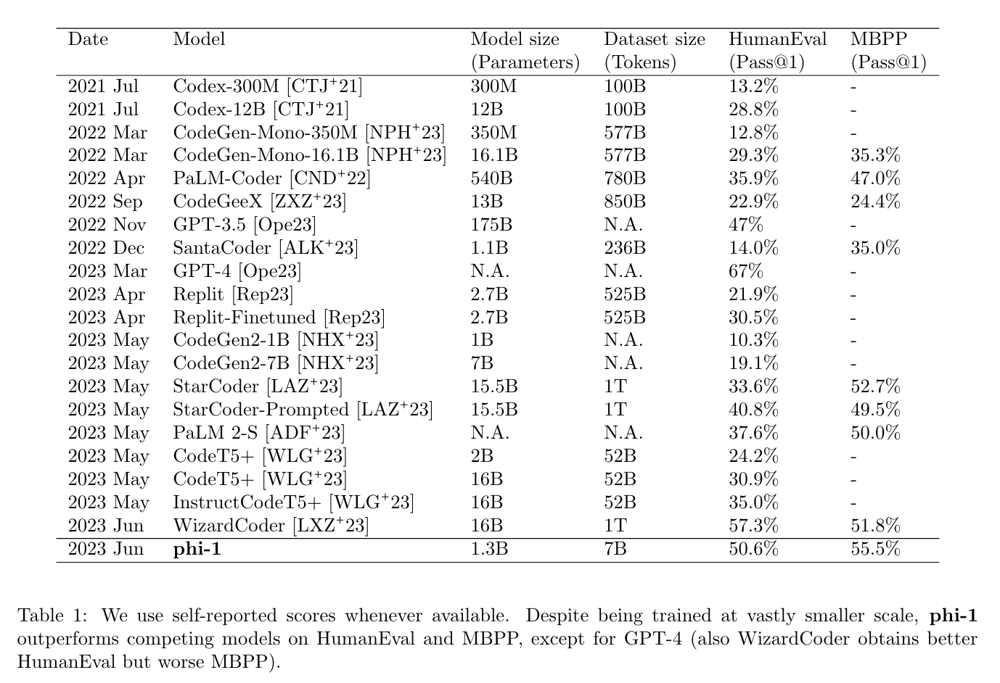

**(논문 요약) Textbooks Are All You Need** [(Paper)](https://arxiv.org/pdf/2306.11644)

## 핵심 내용

- Method: 
   - pretrain on “textbook quality” data (synthetically generated (with GPT-3.5) + filtered from web sources)
   - finetune on “textbook-exercise-like” data  

- Data:
   - A subset of The Stack and StackOverflow filtered by a random forest classifier   

   - A synthetic textbook dataset consisting of <1B tokens of GPT-3.5 generated Python textbooks (constraints on topics and target audience)   

   - A small synthetic exercises dataset consisting of ∼180M tokens of Python exercises and solutions (diversifying the function names with GPT-3.5)

## 실험

