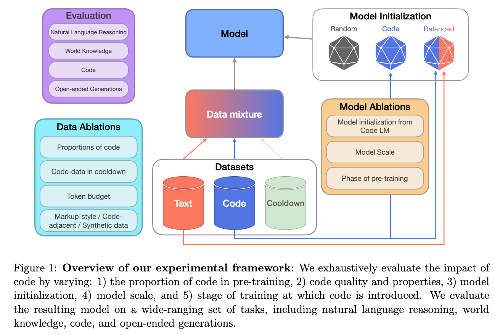
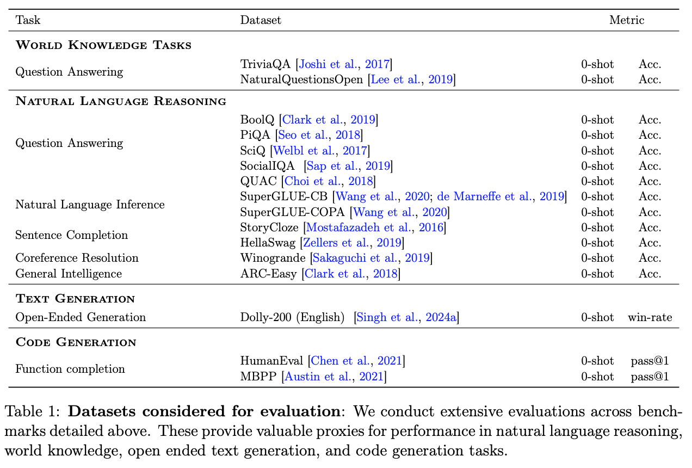
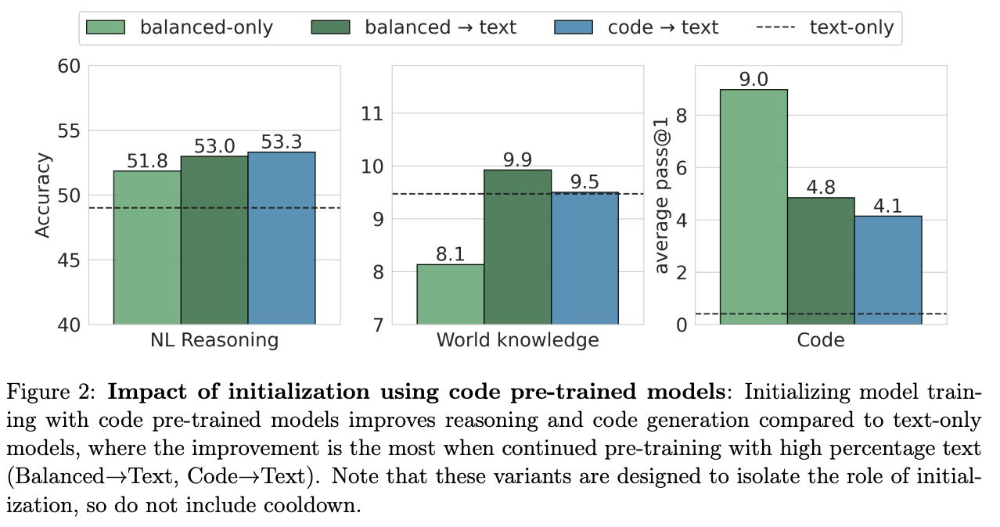
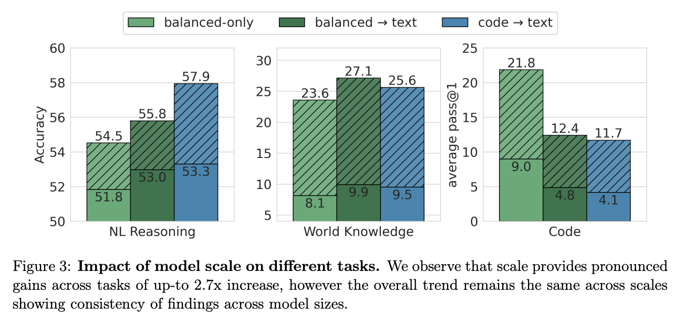
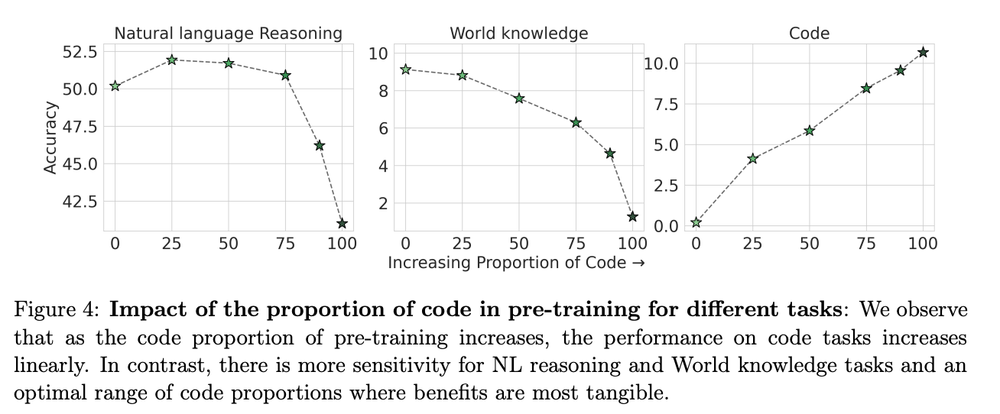
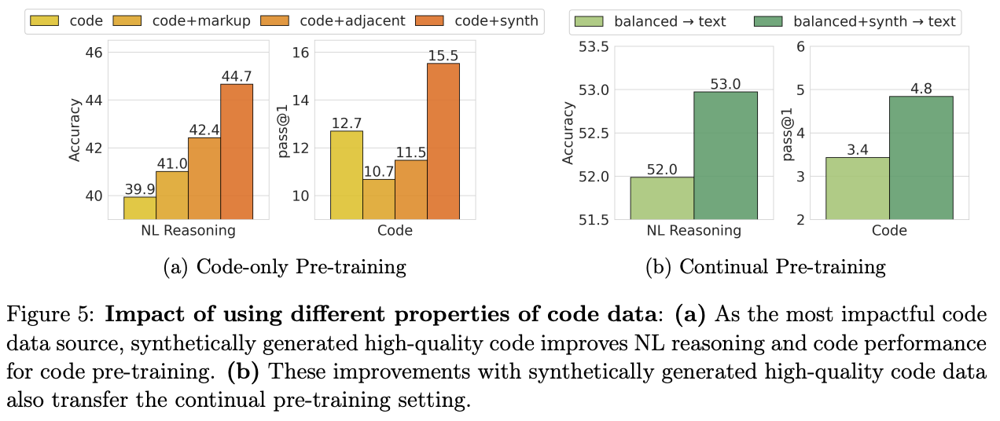
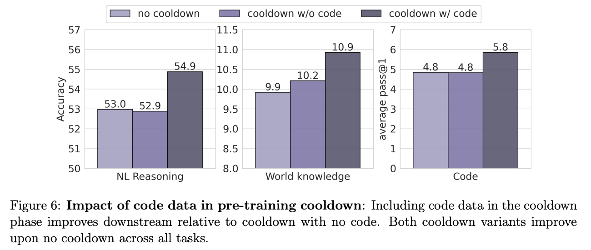

**(논문 요약) To Code, or Not To Code? Exploring Impact of Code in Pre-training** [(Paper)](https://arxiv.org/pdf/2408.10914)

## 핵심 내용
- code 데이터로 다양한 ablation 학습
  - cooldown: pretrain 마지막에 high quality data 비율을 높여서 학습  
  - code adjacent: GitHub commits, jupyter notebooks, StackExchange threads

- benchmark 데이터  

## 실험 결과
- balanced: 50% code + 50% text  

- 2.8B 과 470M 모델 비교  

- 코드 비율별 성능  

- code 데이터 ablation
   - synthetic code: proprietary formally verified python programming problems (3.2B code tokens)     

- cooldown 시 코드 데이터 유무 ablation  

