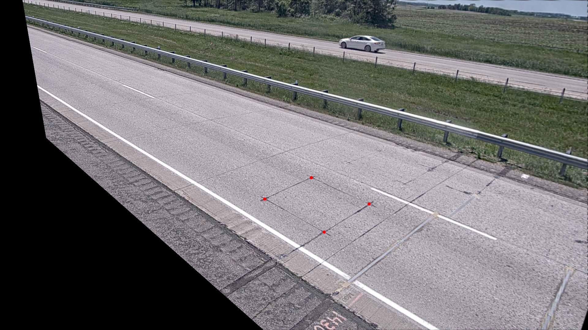
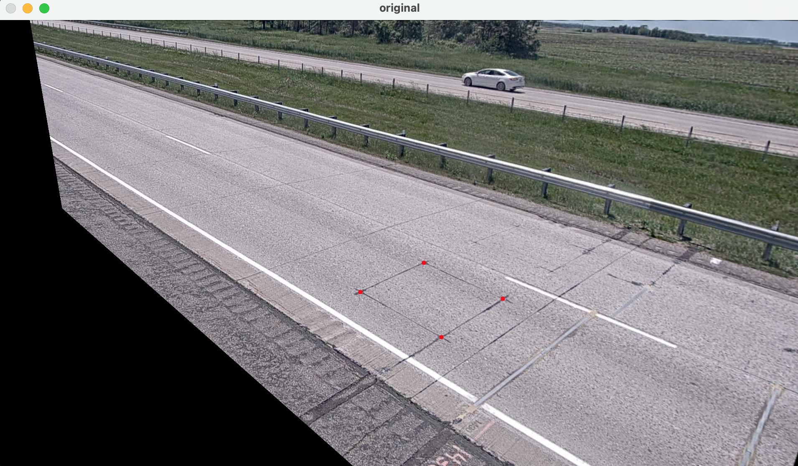
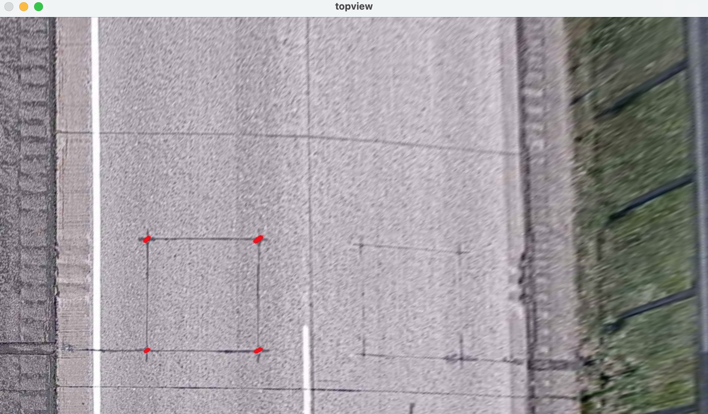

**Top-view perspective transform with OpenCV-Python with OpenCV-Python**

[Reference](https://opencv-python.readthedocs.io/en/latest/doc/10.imageTransformation/imageTransformation.html)

[Image File](https://i.stack.imgur.com/ysl7u.jpg)

[Python File](./data/topview-conversion/topview_conversion.py)

## Input


## Source Code

```python
import cv2
import numpy as np

img = cv2.imread("sample_image.jpeg")

# points of rectangluar objects (from topleft to bottomright clockwise)
pts = np.array([[864, 651], [1016, 581], [1205, 667], [1058, 759]], dtype=np.float32)
for pt in pts:
    cv2.circle(img, tuple(pt.astype(np.int)), 1, (0,0,255), -1)

# compute perspective transform
topleft = (400, 600)
bottomright = (700, 900)
pts_square = np.array([topleft, (bottomright[0], topleft[1]), bottomright, (topleft[0], bottomright[1])], dtype=np.float32)
mat_perspective = cv2.getPerspectiveTransform(pts, pts_square)
assert mat_perspective.shape == (3, 3)
topview_img = cv2.warpPerspective(img, mat_perspective, img.shape[:2][::-1])

cv2.imshow('original', img)
cv2.imshow('topview', topview_img)
cv2.waitKey()
```

## Results



