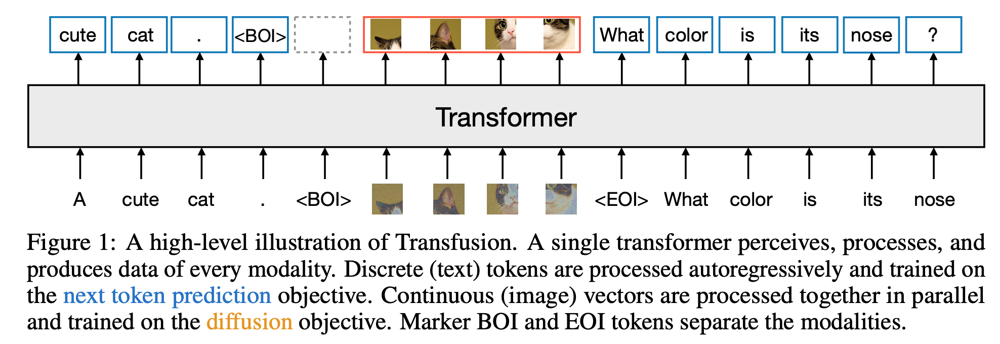
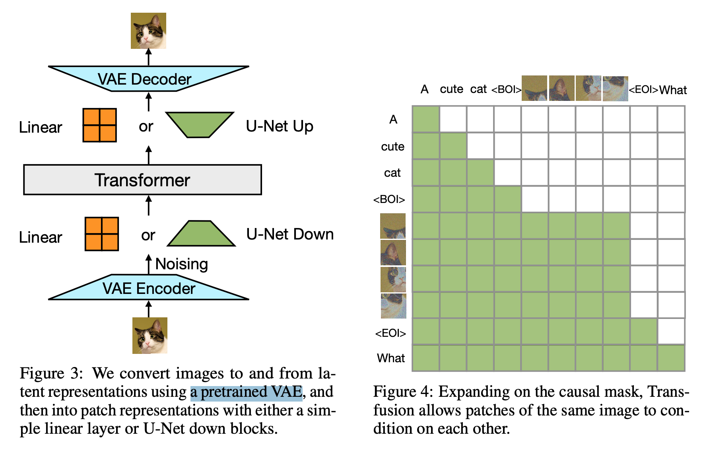
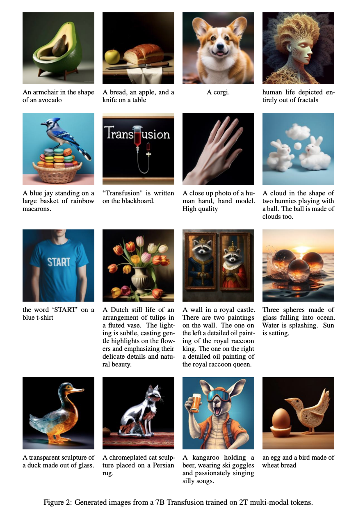
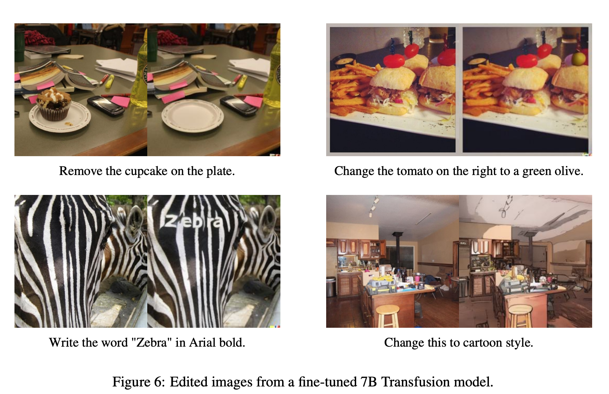

**(논문 요약) Transfusion: Predict the Next Token and Diffuse Images with One Multi-Modal Model** [(Paper)](https://www.arxiv.org/pdf/2408.11039)

## 핵심 내용
- image 와 text 로 pretrain
   - image: diffusion objective
   - text: next token prediction
- inference
   - LM 으로 next (language) token sample 하다가 BOI token 만나면 diffusion model 로 전환
   - diffusion 끝난 뒤, 생성된 이미지와 그 뒤에 EOI 붙이고 다시 next (language) token sample   
   

- image 는 casual mask 에서 전체 볼수 있도록 하고, pretrained VAE 사용하여 diffusion  
   - VAE: 86M, CNN encoder (256×256 -> 8x32×32), decoder  

- 실험 세팅
   - tokenizer: Llama 2
   - training data: 0.5T tokens (patches) at a 1:1 ratio from
       - Llama 2 corpus (2T)
       - 380M licensed Shutterstock images and captions (center-cropped and resized to 256×256)

## 실험 결과
- generation  

- edit
